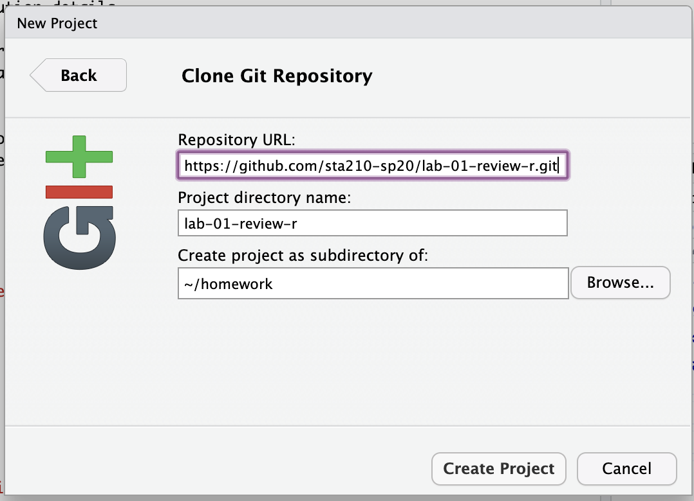

```{r setup, include=FALSE}
knitr::opts_chunk$set(echo = TRUE,
                      warning=FALSE, 
                      message=FALSE, 
                      eval = FALSE)
```

The primary goal of today's' lab is to practice statistical inference and prediction for simple linear regression. Additionally, you continue developing your data visualization and data wrangling skills in R and getting used to the team workflow.

# Getting Started

Each of your assignments will begin with the following steps.

## Clone Assignment Repo

## Clone the repo & start new RStudio project

- Go to the sta210-sp20 organization on GitHub (http://www.github.com/sta210-sp20). Click on the repo with the prefix **lab-01-review-r-**. It contains the starter documents you need to complete the lab.

```{r clone-repo-link, fig.margin = TRUE, echo = FALSE, fig.width=3}
knitr::include_graphics("img/01-intro-r/clone-repo-link.png")
```

- Click on the green **Clone or download** button, select **Use HTTPS** (this might already be selected by default, and if it is, you'll see the text **Clone with HTTPS** as in the image below). Click on the clipboard icon to copy the repo URL.

```{r new-project-from-gh, fig.margin = TRUE, echo = FALSE, fig.width=3, eval = F}
knitr::include_graphics("img/01-intro-r/new-project-from-gh.png")
```

- Go to https://vm-manage.oit.duke.edu/containers and login with your Duke NetId and Password.

- Click to log into the Docker container **STA 210 - Regression Analysis**. You should now see the RStudio environment. 

```{r paste-gh-repo-url, fig.margin = TRUE, echo = FALSE, fig.width=5}

```

- Go to *File* `r emo::ji("arrow_right")` *New Project* `r emo::ji("arrow_right")` *Version Control* `r emo::ji("arrow_right")` *Git*. 

- Copy and paste the URL of your assignment repo into the dialog box *Repository URL*. You can leave *Project Directory Name* empty. It will default to the name of the GitHub repo.


- Click *Create Project*, and the files from your GitHub repo will be displayed the *Files* pane in RStudio. 

## Configure git 

If you are unable to push to GitHub, it may be because you need to configure git. Follow the steps below to configure git.

To do so, you will use the `use_git_config()` function from the `usethis` package. 

Type the following lines of code in the **console** in RStudio filling in your name and email address.

```{marginfigure}
The email address is the one tied to your GitHub account. 
```

```{r eval=FALSE}
library(usethis)
use_git_config(user.name = "GitHub username", user.email="your email")
```

For example, mine would be 

```{r eval=FALSE}
library(usethis)
use_git_config(user.name="matackett", user.email="maria.tackett@duke.edu")
```

If you get the error message

```{r eval=FALSE}
Error in library(usethis) : there is no package called ‘usethis’
```

then you need to install the `usethis` package. Run the following code in the console to install the package. Then, rerun the `use_git_config` function with your GitHub username and email address associated with your GitHub account.

```{r eval=FALSE}
install.package("usethis")
```

Once you run the configuration code, your values for `user.name` and `user.email` will display in the console. If your `user.name` and `user.email` are correct, you're good to go! Otherwise, run the code again with the necessary changes.

## Packages

We will use the following packages in today's lab. 

```{r load-packages}
library(tidyverse)
library(knitr)
library(broom)
library(openintro) 

#fill in any other packages you use in the lab
```

# Data 

Though Starbucks is most famous for it's ever-growing selection of coffee drinks, it has quite the [selection of food](https://www.starbucks.com/promo/food) as well. In today's lab, we will analyze the nutritional data of 77 food items sold at Starbucks. The data was originally obtained from the Starbucks menu in 2011; however, many of the items are still available today.

The data is available in the `starbucks` dataset from the o penintro package. It contains the following variables:  


| Variable 	| Description 	|
|------------	|----------------------------------------------------	|
| `item` 	| Name of food item 	|
| `calories` 	| Total number of calories 	|
| `fat` 	| Total fat (in grams) 	|
| `carb` 	| Total carbohydrates (in grams) 	|
| `fiber` 	| Total fiber (in grams) 	|
| `protein` 	| Total protein (in grams) 	|
| `type` 	| Food category (e.g. bakery, sandwich, salad, etc.) 	|

# Exercises 

When you walk to the counter at Starbucks, you'll notice the large display of its most popular food items. Often, the number of calories is shown in the display but no other nutritional information is visible. Therefore, we'd like to use the total calories to estimate other nutritional values for a food item. Today we will focus on using `calories` to estimate the total carbohydrates (`carb`).

## Exploratory Data Analysis

1. What is the predictor variable? What is the response variable? 

2. Let's begin by examining the distribution of the **<i>predictor variable</i>**. Make a histogram to display the distribution of the predictor variable. Describe the shape of the distribution. 

*Note: Inlcude an informative title and informative labels for the x and y axes. This applies to all plots in the lab.*

3. Use the `summarise` function to calculate measures of center and spread for the **<i>predictor variable</i>**. Only include the measures of center and spread that are appropriate for describing the distribution of the variable.

```{marginfigure}
See the [dplyr reference page](https://dplyr.tidyverse.org/reference/summarise.html) for more information about the `summarise` function. 
```

Below is example code for finding the minimum value of the response.

4. Next, we want to examine the distribution of the response variable. We've primarily used histograms to visualize quantitative data, but let's try something new! Plot the distribution of the **<i>response variable</i>** using an appropriate plot that is **not** a histogram. You can use the [ggplot reference page](https://ggplot2.tidyverse.org/reference/index.html) to help generate ideas and see example code.

5. Briefly describe the type of plot you chose and what features of the distribution are visible using that plot. For example, the description of a histogram may be, 

>*On a histogram, the range of values are divided into bins of equal width, and the number of observations in each bin is shown. From a histogram, one can see the shape of the data. One can also get an idea of the approximate center and spread of the data.*

6. Compare the features of the distribution that are visible on the plot you chose versus a histogram. Which plot do you think is more effective for visualizing the distribution of a quantitative variable? Briefly explain your choice.

7. Make a plot displaying the relationship between the response variable and predictor variable. Describe the relationship between the two variables.  

8. From the plot in the previous question, what assumption for regression might be violated? Briefly explain your reasoning. *Note: We still need to examine the residuals before making a final determination about the model assumptions; however, we can start to get intuition using during the exploratory data analysis.*

## Regression

9. Fit the regression model and display the output including the 95% confidence interval for the slope. Write the model equation. *Use words/variable names when you write the equation (not "x" and "y").* 

10. Below are plots of the residuals needed to check the model assumptions. Recall the assumption you mentioned in Exercise 8. Which plot will you use to assess that assummption? What is your conclusion about whether this model assumption is satisfied? Briefly explain your reasoning. 

```{r echo = F, eval = T}
library(openintro)
library(cowplot)
library(broom)
m <- lm(carb ~ calories, data  = starbucks)
starbucks_m <- augment(m)
p1 <- ggplot(data = starbucks_m, aes(x = calories, y = .resid)) + 
  geom_point() + 
  geom_hline(yintercept  = 0, color = "red") +
  labs(x = "Calories", 
       y = "Residuals", 
       title = "Plot A")
p2 <- ggplot(data = starbucks_m, aes(x = .resid)) +
  geom_histogram() + 
  labs(x = "Residuals", 
       title = "Plot B")

p3 <- ggplot(data = starbucks_m, aes(sample = .resid)) +
  stat_qq() + 
  stat_qq_line() + 
  labs(title = "Plot C")

lower <- plot_grid(p2, p3, ncol = 2)
plot_grid(p1, lower, nrow = 2)
```


11. Comment on the remaining assumptions for simple linear regression. State whether the assumption is satisified and explain your reasoning. 

## Statistical Inference

12. What is the 95% confidence interval for the slope? Interpret this interval in the context of the data.

13. Suppose we want to test the following hypotheses: 

$$\begin{aligned}&H_0: \beta_1 = 0 \\
&H_a: \beta_1 \neq 0
\end{aligned}$$

State the null and alternative hypotheses using words in the context of the data.

14. What is the p-value of this hypothesis test? Use the p-value to state your conclusion in the context of the data. 
15. Consider the confidence interval from Exercise 12 and the hypotheses in Exercise 13. Is the confidence interval consistent with the null or alternative hypothesis? Briefly explain.

## Prediction 

16. You'd like to purchase one piece of pumpkin bread from Starbucks! According to [the Starbucks menu](https://www.starbucks.com/menu/food/bakery/pumpkin-bread-lb?foodZone=9999), pumpkin bread has 410 calories. Predict the average carbohydrates for all pumpkin bread sold by Starbucks. Include the estimate and appropriate interval. 

*You're done and ready to submit your work! Knit, commit, and push all remaining changes. You can use the commit message "Done with Lab 3!", and make sure you have pushed all the files to GitHub (your Git pane in RStudio should be empty) and that <u>all</u> documents are updated in your repo on GitHub. Then submit the assignment on Gradescope following the instructions below.*

# Submitting the Assignment

Once your work is finalized in your GitHub repo, you will submit it to Gradescope. **Your assignment must be submitted on Gradescope by the deadline to be considered "on time".**

To submit your assignment: 

- Go to http://www.gradescope.com and click *Log in* in the top right corner. 

- Click *School Credentials* `r emo::ji("arrow_right")` *Duke NetID* and log in using your NetID credentials.

- Click on the *STA 210 Regression Analysis* course. 

- Click on the assignment, and you'll be prompted to submit it.
    - If asked, login to your GitHub account.
    - If asked, click to request access to the "sta210-sp20" GitHub organization. 
  
- Select your assignment repo and choose "master" for the branch. 

- **Make sure to include the names of all group members who participated in the assignment.** [Click here](https://www.gradescope.com/help#help-center-item-student-group-members) for help on adding group members to an assignment.

- Click *Upload*. You should receive an email to confirm that the assignment has been submitted.

*Notes*: 

- You can see what has been submitted by click "Code" at the top of the page. **We will be grading the PDF file**, so please make sure that has all of your final code, output, and narrative.
- You are welcome to resubmit as many times as you'd like before the deadline (we will only grade the most recent version). Just click the "Resubmit" button at the bottom of the page and reselect your repo and master branch. 

# Grading 

|  	|  	|
|----------------------------------------	|----	|
| Exploratory Data Analysis | 16 	|
| Regression Model & Assumptions |  10	|
| Statistical Inference | 15	|
| Prediction | 4 |
| Lab attendance & participation 	| 3 	|
| Narrative in full sentences 	| 2 	|
| Commit messages from every member| 2 	|
| **Total** | **50** |
