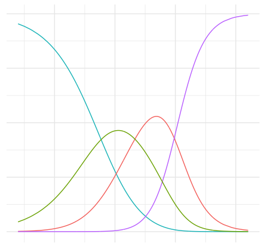

```{r echo=FALSE, fig.align="right",out.width="40%", out.extra='style="float:right; padding:10px"'}

```


The goal of the final project is to apply what you've learned in this course to conduct a statistical analysis. It should be an in-depth regression analysis of a question that interests your group. This question may come from one of your other courses, your research interests, your future career interests, etc. 

The project will consist of 

- **Project proposal**: due Wed, Oct 30 at 11:59p
- **Regression analysis**: due Wed, Nov 20 at 11:59p
- **Final write up**: due Tue, Dec 10 at 5p
- **Presentation**: Wed, Dec 11 9a - 12p (slides due Tue, Dec 10 at 11:59p)

# Data

It is best to start with the question of interest and finding the data second. As you're looking for data, keep in mind your regression analysis must be done using R. Once you find a data set, you should make sure you are able to load it into RStudio, especially if it is in a format we haven't used in class before. If you're having trouble loading your data set into RStudio, ask for help as soon as possible, so you can make any necessary adjustments before the project proposal is due. 

In order for you to have the greatest chance of success with this project it is important that you choose a manageable dataset. This means that the data should be readily accessible and large enough that multiple main effects and interactions can be explored for your model. **Your dataset must have at least 100 observations and at least 10 variables (exceptions can be made but you must speak with me first). The data set should include both quantitative and categorical variables.** 

**Do not reuse datasets used in examples/homework/labs in class.**

## Help finding data 

The Data Visualization Services team (located in Bostock library) has written a guide for finding data for a regression analysis. Please visit [*R Data Resources for Regression Analysis*](https://rfun.library.duke.edu/blog/data-sources-for-regression-analysis/) for guidelines to consider as you search for data along with suggestions for potential data sources.

Other sources that may be helpful: 

- [Kaggle](https://www.kaggle.com/datasets)
- [FiveThirtyEight datasets](https://data.fivethirtyeight.com/)
- ["TidyTuesday" datasets](https://github.com/rfordatascience/tidytuesday)

# Components

### Project proposal (15 pts): due Wed, Oct 30 at 11:59p

There are two main purposes of the project proposal:

- To help you think about the project early, so you can get a head start on finding data, reading relevant literature, thinking about the questions you wish to answer, etc.
- To ensure that the data you wish to analyze, methods you plan to use, and the scope of your analysis are feasible and will help you be successful for this project.
- To begin drafting the introduction section of your final write up.

The proposal should include the sections listed below. Each section should be no longer than approximately one page of text (i.e. excluding graphs, tables, and images).: 

#### Section 1 - Introduction

In the introduction, you will introduce the research question you wish to explore. This includes an introduction to the subject matter you're investigating, the motivation for the for your research question (citing any relevant literature), and your hypotheses regarding the research question of interest. 

#### Section 2 - Exploratory Data Analysis

In this section, you will describe your data set, including the data source. This section will include 

- Overall description of the dataset (how it was collected, what each observation represents, etc.)
- Description of the response variable and its variable type
- Description of the predictor variables being considered for the final model
- Description of any other variables relevant to the analysis, if needed
- Preliminary exploratory data analysis, including some summary statistics and visualizations, along with some explanation on how they help you learn more about your data. (You can add to these later as you work on your project..)

#### Section 3 - Regression Analysis Plan

Description of the approach you will use to model the data. This includes 

  - Interactions you will consider
  - Model selection procedure
  - Regression modeling technique you will use and an explanation about why that method was chosen.
    
#### Section 4 - References

Include the appropriate references for any outside literature.

#### The Data

- Use the `glimpse` function print a summary of the data frame at the end of your proposal.
- Place your data in the `/data` folder, and add dimensions (number of observations and variables) and the data dictionary (a description of every variable in the dataset) to the README in the folder. Make sure the data dictionary is neatly formatted and easy to read.


#### Grading

Total                                                   | 15 pts
--------------------------------------------------------|--------
Introduction                                            | 2 pts
Exploratory Data Analysis                               | 5 pts
Regression Plan                                         | 4 pts
Data                                                    | 2 pts
Organization and formatting                             | 2 pts

### Regression Analysis (25 pts): Due Wed, Nov 20 at 11:59p

The regression analysis will include the bulk of your analysis results. This will become the main portion of your final write up. The regression anlaysis should include the following: 

- Statement of the research question and modeling objective (prediction, inference, etc.)
- Description of the response variable
- Updated exploratory data analysis, incorporating any feedback from the proposal
- Explanation of the modeling process and why you chose those methods, incorporating any feedback from the proposal 
- Output of the final model
- Discussion of the assumptions for the final model
- Interpretations / interesting findings from the model coefficients
- Additional work of other models or analysis not included in the final model.

### Final Write Up (25 pts): due Tue, Dec 10 at 5p

The goal of the write up is to demonstrate your ability to ask meaningful questions and answer them with the results from regression analysis, that
you are proficient in using R, and that you are proficient at interpreting and 
presenting the results. Focus on methods that help you begin to answer your research 
questions. You do not have to apply every statistical procedure we learned.
Also pay attention to your presentation. Neatness, coherency, and clarity will count. 

**You should incorporate the feedback you've received throughout the process in your write up.**

You can add sections as you see fit to the template in your project repo. At a minimum, your write up should have the following sections: 

- **Section 1: Introduction**
    - This is basically a revised version of what is in the project proposal. This should include your research question, hypotheses, and a description of the data. It should also include the exploratory data analysis. 
    
- **Section 2: Regression Analysis**
    - This section includes the results of your final regression model. In addition to displaying the model output, you should include a brief description of why you chose that type of model and any interpretations/ interesting findings from the coefficients. You should also include a discussion of the model assumptions and model fit analysis. 
    
- **Section 3: Discussion & Limitations**
    - This section should include any relevant predictions and/or conclusions drawn from the model. Also critique your own methods and provide suggestions for improving your analysis. 
Issues pertaining to the reliability and validity of your data and 
appropriateness of the regression analysis should also be discussed here. A 
paragraph on what you would do differently if you were able to start over 
with the project or what you would do next if you were going to continue 
work on the project should also be included.

- **Section 4: Conclusion**
    - In this section, you should summarize your project and highlight any final points you wish the reader to get from the project.
    
- **Section 5: Additional Work**
    - This section should include any other models you tried, a check of the assumptions, and a brief explanation of why you didn't select the model.

Before you finalize your write up, make sure your chunks are turned off 
by including `echo = FALSE` in the header of each code chunk. This will hide the R code in the .md file of your final write up.

**The main part of the write up (sections 1 - 4) should contain no more than 5 pages of text (excluding graphs, tables, images).**
<br><br>

#### Grading

For each component, points will be awarded as follows: 

- *Full points*: Item is fully, thoroughly, and accurately addressed.
- *Half points*: Item partially addressed and/or has some inaccuracies.
- *No points*: Item is missing, is insufficiently addressed, or has substantial inaccuracies.

| **Component** 	| **Total** 	| **Assessment** 	|
|--------------------------	|-----------	|---------------------------------------------------------------------------------------------------------------------------------------------------------------------------------------------------------------------------------------------------------------------------------------------------------------------------------------------------------------	|
| Introduction & EDA 	| 5 	| Is the research question, motivation for regression analysis, and data clearly described Are univariate distributions in the data clearly visualized and described using the appropriate summary statistics? Are relevant and interesting bivariate relationships clearly visualized and described using the appropriate summary statistics? 	|
| Regression Analysis 	| 10 	| Is the final regression model appropriate for the data and the original research question/objective? Was a model beyond the main effects model considered? Does it appear the model fitting process was carefully thought out and executed? 	|
| Model Assumptions 	| 3 	| Are the assumptions and model diagnostics thoroughly and accurately assessed? If there are violations, are they accurately identified? Is there a reasonable attempt (i.e. based on what we’ve learned this semester) to correct violations in the assumptions? 	|
| Discussion & Limitations 	| 4 	| Are interesting findings from the model clearly described? If model is used for prediction, is the model’s predictive power thoroughly explored? Is there thorough discussion on model performance? Are the limitations carefully considered and described? 	|
| Writing & Organization 	| 3 	| What is the quality of the statistical presentation, writing, and explanations? Does write up tell a story? Is document neatly organized?,This includes appropriate section headers, figures appropriately sized with informative labels, all code suppressed in .md document, all R messages and warnings suppressed, narrative and output neatly organized. 	|
| **Total** 	| **25** 	|  	|

### Presentation (15 pts): slides due Tue, Dec 10 at 11:59p

**Your presentation should be no longer than 8 minutes, and each team member should say something substantial.**

You can use any software you like for your final presentation, including R Markdown
to create your slides. There isn't a limit to how many slides you can use, just a 
time limit (8 minutes total). Each team member should get a chance to speak during 
the presentation. Your presentation should not just be an account of everything you 
tried ("then we did this, then we did this, etc."), instead it should convey what 
choices you made, and why, and what you found.

**Presentation schedule**: All teams will present during the university scheduled time of the final exam for this course, on Wed, Dec 11 9a - 12p. The presentation schedule is below; however, the write up and presentations are due on Tue, Dec 10 at 5p <u>all teams</u>.

- Section 01L: 9a - 10:30a
- Section 02L: 10:30a - 12p
<br><br>

#### Grading
<br>

**Rubric for presentation grade**


| Component 	| Total 	| Assessment 	|
|-----------------	|-------	|-------------------------------------------------------------------------------------------------------------------------------	|
| Content 	| 5 	| The group told a unified story that highlights the main results from their analysis. 	|
| Slides 	| 5 	| The presentation slides were organized, included clear and informative visualizations, and were readable (not too much text). 	|
| Time Management	| 2 	| Team divided the time well, stayed within the 8 minute time limit, and all team members spoke. 	|
| Professionalism 	| 3 	| The group's presentation was clear and professional. 	|
| **Total** 	| **15** 	|  	|

<br>

**Rubric for classmate scores**

| **Component** 	| **Total** 	| **Assessment** 	|
|-----------------	|-----------	|-------------------------------------------------------------------------------------------------------------------------------	|
| Slides 	| 3 	| The presentation slides were organized, included clear and informative visualizations, and were readable (not too much text). 	|
| Professionalism 	| 2 	| The group's presentation was clear and professional. 	|
| **Total** 	| **5** 	|  	|


#### Deliverables

Your submission should include

* RMarkdown file (formatted to clearly present all of your code and results) 
* .md file (able to be viewed on GitHub, with all figures)
* Dataset(s) (in csv or RData format, in a `/data` folder)
* Presentation (if using Keynote/PowerPoint/Google Slides, export to PDF and put in repo, in a `/presentation` folder)

Style and format does count for this assignment, so please take the time to make 
sure everything looks good and your data and code are properly formatted.

# Overall Grading 

Total                          | 100 pts
-------------------------------|--------
Proposal                       | 15 pts
Regression Analysis            | 25 pts
Final Writeup                  | 25 pts
Presentation                   | 15 pts
Classmates' presentation scores| 5 pts
Team peer evaluation           | 10 pts

**Team peer evaluation:** You will be asked to fill out a survey where you 
rate the contribution and teamwork of each team member out of 10 points. You will 
additionally report a contribution percentage for each team member. Filling out the 
survey is a prerequisite for getting credit on the team member evaluation.
If you are suggesting that an individual did less than 20% of the work, please
provide some explanation. If any individual gets an average peer score 
indicating that they did less than 10% of the work, this person will receive 
half the grade of the rest of the group.

The project will be graded based on the following criteria: 

- **Consistency: **Did you clearly answer the question of interest?
- **Clarity: **Can the audience easily understand your analysis process and any sort of conclusions/arguments you make?
- **Relevancy: **Did you use the appropriate statistical techniques to address your question? Was your analysis thorough (e.g. did you consider interactions in addition to main effects?)?
- **Interest: **Did you attempt to answer a challenging and interesting question rather than just calculating a lot of descriptive statistics and simple linear regression models?
- **Organization: **Is your write up and presentation organized in a way that is neat and clear for the audience to understand? 

A general breakdown of scoring is as follows:

- *90%-100%*: Outstanding effort. Student understands how to apply all statistical 
concepts, can put the results into a cogent argument, can identify weaknesses in 
the argument, and can clearly communicate the results to others.
- *80%-89%*: Good effort. Student understands most of the concepts, puts together 
an adequate argument, identifies some weaknesses of their argument, and communicates 
most results clearly to others.
- *70%-79%*: Passing effort. Student has misunderstanding of concepts in several 
areas, has some trouble putting results together in a cogent argument, and communication 
of results is sometimes unclear.
- *60%-69%*: Struggling effort. Student is making some effort, but has misunderstanding 
of many concepts and is unable to put together a cogent argument. Communication 
of results is unclear.
- *Below 60%*: Student is not making a sufficient effort.

**Late penalty:**

- Late, but within 24 hours of due date/time: -20% (only applies to written portion, there is no option to do your presentation later)
- Any later: no credit 

# Getting started

- Go to the course organization on GitHub: [https://github.com/Sta210-fa19](https://github.com/Sta210-fa19).

- Find the repo starting with `project` and that has your team name at the end (this should be the only `project` repo available to you).

- In the repo, click on the green **Clone or download** button, select **Use HTTPS** (this might already be selected by default, and if it is, you'll see the text **Clone with HTTPS** as in the image below). Click on the clipboard icon to copy the repo URL.

- Go to RStudio Cloud and into the course workspace. Create a **New Project from Git Repo**. You will need to click on the down arrow next to the **New Project** button to see this option.

- Copy and paste the URL of your assignment repo in the dialog box and click OK. 

# Tips

- You're working in the same repo as your teammates now, so merge conflicts will happen, issues will arise, and that’s fine! Commit and push often, and ask questions when stuck.

- Review the grading guidelines and ask questions if any of the expectations are unclear.

- Make sure each team member is contributing, both in terms of quality and quantity of contribution (we will be reviewing commits from different team members).

- Set aside time to work together both in the same location and remotely.

- When you're done, review the .md document on GitHub to make sure you're happy with the final state of your work.

- *Code*: In your write up your code should be hidden (`echo = FALSE`) so that your 
document is neat and easy to read. However your document should include 
all your code such that if I re-knit your Rmd file I should be 
able to obtain the results you presented. **Exception:** If you want to 
highlight something specific about a piece of code, you're welcomed to show 
that portion. 

- *Teamwork*: You are to complete the assignment as a team. All team members are expected 
to contribute equally to the completion of this assignment and group 
assessments will be given at its completion - anyone judged to not have sufficient 
contributed to the final product will have their grade penalized. While different 
teams members may have different backgrounds and abilities, it is the responsibility 
of every team member to understand how and why all code and approaches in 
the assignment works.

# Undergraduate Statistics Class Project Competition

The project for this class is eligible for the Undergraduate Statistics Class Project Competition sponsored by The Consortium for the Advancement of Undergraduate Statistics Education ([CAUSE](https://www.causeweb.org/cause/)) and the American Statistical Association ([ASA](https://www.amstat.org/)). Submissions are due on **<u>Friday, December 20, 2019</u>**. 

You can find more information about the project here: https://www.causeweb.org/usproc/usclap

This is a great opportunity to share your work outside of class and potentially win a cash prize! Please let Professor Tackett know if you are interested in submitting your project to the competition.

# Additional resources

- [ggplot2 Reference](https://ggplot2.tidyverse.org/reference/index.html)
- [Introduction to Effective Data Visualization](https://library.capture.duke.edu/Panopto/Pages/Viewer.aspx?id=6bbfe49f-deb4-4d5f-bdf4-244d5f88a219)
- [Visualization in R using ggplot2](https://library.capture.duke.edu/Panopto/Pages/Viewer.aspx?id=7b91aa85-4cb9-4936-ac62-a96700d59246)
- [Data and Visualization Services walk-in office hours](https://library.duke.edu/data/about/schedule)


