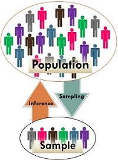

```{r setup, include=FALSE}
# R options
options(
  htmltools.dir.version = FALSE, # for blogdown
  show.signif.stars = FALSE,     # for regression output
  warm = 1
  )
# Set dpi and height for images
library(knitr)
opts_chunk$set(fig.height = 2.65, dpi = 300) 
# ggplot2 color palette with gray
color_palette <- list(gray = "#999999", 
                      salmon = "#E69F00", 
                      lightblue = "#56B4E9", 
                      green = "#009E73", 
                      yellow = "#F0E442", 
                      darkblue = "#0072B2", 
                      red = "#D55E00", 
                      purple = "#CC79A7")

options(htmltools.dir.version = FALSE)
knitr::opts_chunk$set(
	fig.align = "center",
	fig.height = 3.5,
	fig.width = 6.25,
	message = FALSE,
	warning = FALSE
)
```

```{r echo=FALSE, message=FALSE, warning=FALSE}
library(tidyverse)
library(gridExtra)
library(infer)
```

class: middle, center

### [Click for PDF of slides](01-review-ci.pdf)

---

## Announcements

- Complete [surveys and consent form](https://www2.stat.duke.edu/courses/Spring20/sta210.001/misc/jan8.html) by Wed at 11:59p

- [Reading for today & Wednesday](https://www2.stat.duke.edu/courses/Spring20/sta210.001/reading/reading-01.html)

- Office hours start today. See [course homepage](https://www2.stat.duke.edu/courses/Spring20/sta210.001/) for schedule

- **New to R or need a refresher?**
  - Attend an Intro to R workshop 
  - Offered Jan 13 - 16, 6p - 7:30p, Gross Hall 270 (choose 1 night to attend)
  - [Click here](https://forms.office.com/Pages/ResponsePage.aspx?id=TsVyyzFKnk2xSh6jbfrJTFvPd3eQtCxBtEvbtkDole1UNjYyVzVTSFdYMVJaWDBXUEhQS0tXWE81VC4u) to sign up
  
- Find more info about statistics related events on [Sakai](https://sakai.duke.edu)

---

class: middle, center

### Any questions from last class?

---

### Today's Agenda

- Sampling distributions & the Central Limit Theorem

- Calculating & interpreting confidence intervals

---

### *Sesame Street*

- *Sesame Street* is a television series designed to teach children ages 3-5 basic education skills such as reading (e.g. the alphabet) and math (e.g. counting)

- Today we are going to analyze data from an [study conducted by the Educational Testing Service](http://files.eric.ed.gov/fulltext/ED122799.pdf) in the early 1970s to test the  effectiveness of the program. 

```{r fig.align="center",out.width="50%",echo=FALSE}
knitr::include_graphics("img/01/sesame_street.jpg")
```
---

### *Sesame Street* study

- Children from 6 locations around the United States (including Durham!) participated in the 26-week study. The children were split into two groups (`treatment`):
      + **Group 1**: Those who were encouraged to watch the show (assume watched regularly)
      + **Group 2**: Those who didn't get encouragement to watch the show (assume didn't watch regularly)

- Each child was given a test before and after the study to measure their knowledge of basic math, reading, etc.

- We will focus on the change in reading (identifying letters) scores (`change`)
<br><br>

<small>
[Sesame Street Data - Full Description](http://www2.stat.duke.edu/~jerry/sta210/sesamelab.html) 
Original Study: *Ann Bogatz, Gerry & Ball, Samuel. (1971). The Second Year of Sesame Street: A Continuing Evaluation. Volume 1. vols. 1 & 2.*
</small>

---

### Let's look at the data

`sesame_street.csv` is available in the datasets repo on GitHub.

```{r, echo = F}
sesame_street <- read_csv("data/sesame_street.csv")
```

```{r}
sesame_street %>%
  slice(1:10)
```

---

### Exploratory Data Analysis - Univariate

<small>
```{r}
ggplot(data = sesame_street, mapping = aes(x = change)) +
  geom_histogram(fill = "steelblue", color = "black") +
  labs(x = "Change in Reading Score (Post - Pre)" , 
       title = "Distribution of the Change in Reading Scores")
```
</small>

---

### Exploratory Data Analysis - Univariate

- Calculate summary statistics for `change`
<small>
```{r}
sesame_street %>%
  summarise(n = n(), min = min(change), median = median(change), max = max(change), 
            IQR = IQR(change), 
            mean = mean(change), std_dev = sd(change))
```
</small>

---

### Exploratory Data Analysis - Bivariate

<small>
```{r fig.height = 3}
ggplot(data = sesame_street, 
       mapping = aes(y = change, x = treatment)) +
  geom_boxplot(fill = "steelblue") +
  labs(y = "Change in Reading Score (Post - Pre)",
         title = "Distribution of the Change in Reading Score", 
       subtitle = "Encouraged vs. Not Encouraged.")
```
</small>

---

### Exploratory Data Analysis - Bivariate

Calculate summary statistics for `change` for each group of `treatment`
<small>
```{r}
sesame_street %>%
  group_by(treatment) %>%
  summarise(n = n(), min = min(change), median = median(change), 
            max = max(change), IQR = IQR(change), 
            mean = mean(change), std_dev = sd(change))
```

---

### What is statistical inference?

.pull-left[

```{r fig.align="center",out.width="80%",echo=FALSE}

```
]

.pull-left[
- <font class = "vocab">Statistical inference</font> is the process of using sample data to make conclusions about the underlying population from which the sample was taken

- Types of inference:
  - <font class="vocab">Confidence Intervals: </font> Estimate the parameter of interest
  - <font class="vocab">Hypothesis Tests: </font> Test a specified claim or hypothesis
]

<font size = "3">
Image source: https://keydifferences.com/difference-between-population-and-sample.html
</font>
---

class: middle, center

### Confidence Interval for a Population Mean

---

### Confidence Intervals

- Developed by Jerzy Neyman (in the 1930s)

- <font class="vocab">**What**</font>: Plausible range of values for a population parameter
  + Assuming sample data is a random sample from the population
  
- <font class="vocab">**Why**</font>: Because the statistic is a random variable, its value is subject to chance error, i.e. random variability
  + We want to take that variability into account by reporting a range of plausible values the parameter can take rather than solely relying on a single statistic

---

### Let's think about the *Sesame Street* data

- We want to know the true mean change in reading scores for all children in the U.S. ages 3 - 5 after 26 weeks (the length of the study). This is the .vocab[population parameter].

<br><br>
--

- We aren't able to collect data on all children in the U.S. ages 3 - 5, but we do have data on 240 children who participated in the study and can calculate their mean change in reading scores. This is the .vocab[sample statistic] (also known as *point estimate*).

---

### Let's think about the *Sesame Street* data


- Our best guess for the true mean change in reading scores is the mean change in reading scores from our sample: 10.8

<br><br>
--

- If we did the study again using 240 different children, we'd expect the mean change in reading score for that sample to differ from 10.8. This is .vocab[sampling variability]. 

<br><br>
--

- Our goal, then, is to account for that sampling variability and calculate a plausible range of values the true mean can take.


---

### Sampling distribution

- A .vocab[sampling distribution] is the distribution of sample statistics from random samples of the same size taken with replacement from a population

- In practice it is impossible to construct sampling distributions,  since it would 
require having access to the entire population. However, we have theorems that tell us what the sampling distribution will look like (more on this shortly.)

--

- For now, let's do a couple of demonstrations to get an idea about some basic properties of sampling distributions. 
    - For the demonstration, we will make the unrealistic assumption that we have access ot the population and will construct the sample distribution. 
    
---

### The population

```{r}
set.seed(011320)
norm_pop <- tibble(x = rnorm(n = 100000, mean = 20, sd = 3))
ggplot(data = norm_pop, aes(x = x)) +
  geom_histogram(binwidth = 1) +
  labs(title = "Population distribution")
```

---

### Sampling from the population - 1

```{r}
samp_1 <- norm_pop %>%
  sample_n(size = 50, replace = TRUE)
```

--

```{r}
samp_1 %>%
  summarise(x_bar = mean(x))
```

---

### Sampling from the population - 2

```{r}
samp_2 <- norm_pop %>%
  sample_n(size = 50, replace = TRUE)
```

--

```{r}
samp_2 %>%
  summarise(x_bar = mean(x))
```


---

### Sampling from the population - 3

```{r}
samp_3 <- norm_pop %>%
  sample_n(size = 50, replace = TRUE)
```

--

```{r}
samp_3 %>%
  summarise(x_bar = mean(x))
```


--

.vocab[keep repeating...]

---

### Population vs. sampling distributions

```{r echo = F}
sampling <- norm_pop %>%
  rep_sample_n(size = 50, replace = TRUE, reps = 1000) %>%
  group_by(replicate) %>%
  summarise(xbar = mean(x))
```

```{r echo=FALSE, fig.height= 4}
p1 <- ggplot(data = norm_pop, aes(x = x)) +
  geom_histogram(binwidth = 1) +
  labs(title = "Population distribution") +
  theme(axis.title.y = element_blank(),
        axis.text.y  = element_blank(),
        axis.ticks.y = element_blank()) + 
  xlim(5, 35)
p2 <- ggplot(data = sampling, aes(x = xbar)) +
  geom_histogram(binwidth = 0.25) +
  labs(title = "Sampling distribution of sample means") +
  theme(axis.title.y = element_blank(),
        axis.text.y  = element_blank(),
        axis.ticks.y = element_blank()) +
  xlim(5, 35)
grid.arrange(p1, p2, nrow = 2)
```

---

### Discussion 

Take a minute to discuss the following with 1 - 2 people around you: 

.question[
How do the shapes, centers, and spreads of these distributions compare?
]

---

### Let's simulate another distribution

```{r}
rs_pop <- tibble(x = rbeta(100000, 1, 5) * 100)
```

```{r echo=FALSE, fig.height=2}
ggplot(data = rs_pop, aes(x = x)) +
  geom_histogram(binwidth = 5) +
  labs(title = "Population distribution") +
  theme(axis.title.y = element_blank(),
        axis.text.y  = element_blank(),
        axis.ticks.y = element_blank())
```

```{r echo=FALSE}
rs_pop %>%
  summarise(mu = mean(x), sigma = sd(x))
```

---

### Sampling distribution

```{r}
sampling <- rs_pop %>%
  rep_sample_n(size = 50, replace = TRUE, reps = 1000) %>%
  group_by(replicate) %>%
  summarise(xbar = mean(x))
```

```{r echo=FALSE, fig.height=2}
ggplot(data = sampling, aes(x = xbar)) +
  geom_histogram(binwidth = 1) +
  labs(title = "Sampling distribution of sample means") +
  theme(axis.title.y = element_blank(),
        axis.text.y  = element_blank(),
        axis.ticks.y = element_blank())
```

```{r echo=FALSE}
sampling %>%
  summarise(mean = mean(xbar), se = sd(xbar))
```

---

### Population vs. sampling distribution 

```{r echo=FALSE, fig.height=3.5}
p1 <- ggplot(data = rs_pop, aes(x = x)) +
  geom_histogram(binwidth = 5) +
  labs(title = "Population distribution") +
  xlim(-5, 100) +
  theme(axis.title.y = element_blank(),
        axis.text.y  = element_blank(),
        axis.ticks.y = element_blank())
p2 <- ggplot(data = sampling, aes(x = xbar)) +
  geom_histogram(binwidth = 1) +
  labs(title = "Sampling distribution of sample means") +
  xlim(-5, 100) +
  theme(axis.title.y = element_blank(),
        axis.text.y  = element_blank(),
        axis.ticks.y = element_blank())
grid.arrange(p1, p2, nrow = 2)
```

---

### In-class exercise 

.question[

- Use the two examples we just discussed to answer the questions: http://bit.ly/sta210-sp20-samp 

- Use **NetId@duke.edu** for your email address.

- You are welcome (and encouraged!) to discuss these questions with 1 - 2 people around you, but **each person** must submit a response.
]

---

### Central Limit Theorem

- Using the .vocab[Central Limit Theorem (CLT)] we know the form of the sampling distribution for certain statistics such as the mean, proportion, difference in means, etc.
    - CLT does not apply to all statistics (e.g. the median)

- By the Central Limit Theorem, when the conditions are met, we know the sampling distribution of the sample statistic will...
  - be approximately Normal
  - have a mean equal to the unknown population parameter
  - have a standard deviation proportional to the inverse of the square root of the sample size.

- Get more details on the derivation of the CLT in STA 240 & STA 250

---

### CLT for a population mean 

.alert[
Suppose we have a population with mean $\mu$ and standard deviation $\sigma$. By the CLT, when conditions are met, the sampling distribution of the sample mean is 

$$\bar{x} \sim N\Big(\mu, \frac{\sigma}{\sqrt{n}}\Big)$$
]

---

### Conditions for CLT

- **Independence**: The sampled observations must be independent. This is difficult to check, but the following are useful guidelines:
    - the sample must be random
    - if sampling without replacement, sample size must be less than 10% of the population size

- **Sample Size**: Sample size is large. Usually $n > 30$ is considered large enough sample. Need larger sample size if population distribution is extremely skewed. 

- **Independent Groups**: If comparing two populations, the groups must be independent of each other, and all conditions should be checked for both groups.

---

## Standard Error

- By the CLT, the standard deviation of the sampling distribution of $\bar{x}$ is $\sigma/ \sqrt{n}$. 

- In practice, we don't know the population standard deviation $\sigma$, but we can estimate it using the sample standard deviation $s$. 

- The <font class="vocab">standard error (SE) </font> is the *standard deviation* of the *sampling distribution*, calculated using sample statistics

.alert[
$$SE(\bar{x}) = \frac{s}{\sqrt{n}}$$
]

- We will use the standard error for calculations of confidence intervals and hypothesis tests

---

### Confidence interval for the mean

The $C$% confidence interval to estimate the population mean, $\mu$,  is 

.alert[
$$\bar{x} \pm t_{df}^* \times \frac{s}{\sqrt{n}}$$
where $t_{df}^*$ is the critical value calculated from the $t$ distribution with $n-1$ degrees of freedom. 
]

---

## t-distribution vs. Normal 

- We need to account for the extra variability that comes from using $s/\sqrt{n}$ (instead $\sigma/\sqrt{n}$). Therefore, we will use the $t$ distribution for the shape of the sampling distribution of $\bar{x}$ in our calculations.

```{r, echo=FALSE,out.width = '70%'}
knitr::include_graphics("img/02/tdistribution.png")
```

<font size="2">Picture from <i>The Basic Practice of Statistics (7th edition)</i></font>

---

### 95% CI for mean change in reading scores

Let's write the equation for the 95% confidence interval for the mean change in reading scores after 26 weeks for children ages 3 - 5.

```{r echo = F}
sesame_street %>%
  summarise(n = n(), mean = mean(change), std_dev = sd(change))
```

```{r}
(t_star <- qt(0.975, 239))
```

---

### 95\% CI for mean change in reading scores

We can also calculate the 95% confidence interval using the `t.test` function in R

```{r}
t.test(sesame_street$change, conf.level = 0.95)
```


---


### What does "95% confidence" mean?

<div align="center">
```{r, echo=FALSE,out.width = '50%'}
knitr::include_graphics("img/02/confidence_intervals.png")
```
</div>

.small[
- Suppose we take a lot of samples and calculate a 95% confidence interval from each

- We would expect about 95% of these intervals to contain the true population mean, i.e. the parameter of interest

- Some sample means will be far away from the parameter and that's OK. The interval is only a plausible range of values. We may conclude that other values are not plausible based on our data, but that doesn't mean other values are impossible. 
]

---

### In-class exercise

.question[

- Answer the questions at http://bit.ly/sta210-sp20-CI

- Use **NetId@duke.edu** for your email address.

- You are welcome (and encouraged!) to discuss these questions with 1 - 2 people around you, but **each person** must submit a response.
]

---

class: middle, center

### Confidence Interval for the Difference in Two Means


---

### Difference in mean reading score change

Let Group 1 be the those encouraged to watch *Sesame Street* and Group 2 who got no encouragement to watch the show 

```{r}
sesame_street %>%
  group_by(treatment) %>%
  summarise(n = n(), mean = mean(change), sd = sd(change))
```

- **Parameter**: $\mu_{1} - \mu_{2}$
- **Statistic**: $\bar{x}_{1} - \bar{x}_{2}$

- We want to estimate the difference in the mean change in reading scores between the two groups,  i.e. estimate $\mu_{1} - \mu_{2}$. 


---

### Sample distribution of $\bar{x}_1 - \bar{x}2$

- In the *Sesame Street* example, the parameter of interest is the difference in means, $\mu_{1} - \mu_{2}$. Let's look at the confidence interval for $\mu_{1} - \mu_{2}$ based on the CLT

- The statistic is the difference in sample means $\bar{x}_1 - \bar{x}_2$

- Assuming the conditions for the CLT are met (independent observations, large $n$, independent groups), the sampling distribution for $\bar{x}_1 - \bar{x}_2$ is 

$$\bar{x}_1 - \bar{x}_2 \sim N \Bigg(\mu_1 - \mu_2, \sqrt{\frac{\sigma_1^2}{n_1} + \frac{\sigma_2^2}{n_2}}\Bigg)$$

---

### Confidence interval for the difference in means

.alert[
The $C%$ confidence interval to estimate $\mu_1 - \mu_2$ is 

$$(\bar{x}_1 - \bar{x}_2) \pm t_{df}^* \times \sqrt{\frac{s_1^2}{n_1} + \frac{s_2^2}{n_2}}$$
where $t_{df}^*$ is the critical value calculated from the *t* distribution with *df* degrees of freedom.
]

---

### Standard Error of $\bar{x}_1 - \bar{x}_2$

- In practice, we don't know the population standard deviations $\sigma_1$ and $\sigma_2$

--

- We will use the sample standard deviations $s_1$ and $s_2$ to estimate $\sigma_1$ and $\sigma_2$

--

- Thus, the <font class="vocab">**standard error of $\mathbf{\bar{x}_1 - \bar{x}_2}$**</font> is

.alert[
$$SE(\bar{x}_1 - \bar{x}_2) = \sqrt{\frac{s_1^2}{n_1} + \frac{s_2^2}{n_2}}$$
]
---

## Calculating the critical value 

The critical value, $t^*$, follows a $t$ distribution with degrees of freedom given by the formula:
<br>
<br>

$$df = \frac{\Big(\frac{s_1^2}{n_1} + \frac{s_2^2}{n_2}\Big)^2}{\frac{1}{n_1-1}\Big(\frac{s_1^2}{n_1}\Big)^2 + \frac{1}{n_2-1}\Big(\frac{s_2^2}{n_2}\Big)^2} \approx min\{n_1-1,n_2-1\}$$
<br>
<br>
In practice, we can use R to calculate the degrees of freedom.

---

### 95% confidence interval for the difference in means

```{r}
sesame_street %>%
  group_by(treatment) %>%
  summarise(n = n(), mean = mean(change), std_dev = sd(change))
```


```{r echo = F}
treatment <- sesame_street %>% filter(treatment == "Encouraged")
control <- sesame_street %>% filter(treatment == "Not Encouraged")

var1 <- var(treatment$change)
var2 <- var(control$change)
n1 <- nrow(treatment)
n2 <- nrow(control)
se <- sqrt(var1 / n1 + var2 / n2)
```

```{r}
(df <-  (var1/n1 + var2/n2)^2/((var1/n1)^2*(n1-1)^(-1) + (var2/n2)^2*(n2-1)^(-1)))

(t_star <- qt(0.975, df))
```

---

### 95% confidence interval for the difference in means

We can also calculate the 95% confidence interval for the difference in means using the `t.test` function

```{r}
t.test(change ~ treatment, data = sesame_street, conf.level = 0.95)
```

---

### 95% confidence interval for the difference in means

The 95% confidence interval for the difference in mean reading score change is [1.682, 1.758]. 

.question[
Interpret this interval in the context of the data. 

Using this interval, is there evidence of a statistically significant difference in the mean change in reading scores between those encouraged to watch *Sesame Street* and those who got no encouragement to watch the show?
]

---

class: middle, center

### Accessing RStudio & GitHub

---

### Access RStudio & GitHub

.vocab[RStudio]

- Go to https://vm-manage.oit.duke.edu/containers and login using your Net ID

- Click to log in to the Docker container called **STA 210 - Regression Analysis**

<br>

.vocab[GitHub]

- Go to https://github.com/sta210-sp20

- Click to accept the invite at the top of the page. This will make you a member of the sta210-sp20 organization on GitHub

- If you don't see the invite, click [here](https://docs.google.com/forms/d/e/1FAIpQLSfeTP2Li3xROLS_klixE6Ju8wZOqSWSdk_91PrKaqFPjoHEYw/viewform) to (re)submit your GitHub username.

