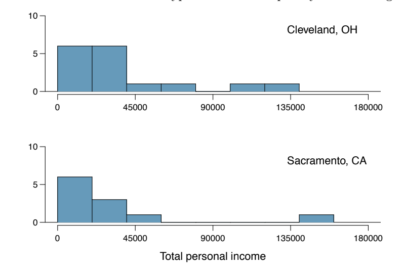

```{r setup, include=FALSE}
# R options
options(
  htmltools.dir.version = FALSE, # for blogdown
  show.signif.stars = FALSE,     # for regression output
  warm = 1
  )
# Set dpi and height for images
library(knitr)
opts_chunk$set(fig.height = 2.65, dpi = 300) 
# ggplot2 color palette with gray
color_palette <- list(gray = "#999999", 
                      salmon = "#E69F00", 
                      lightblue = "#56B4E9", 
                      green = "#009E73", 
                      yellow = "#F0E442", 
                      darkblue = "#0072B2", 
                      red = "#D55E00", 
                      purple = "#CC79A7")

options(htmltools.dir.version = FALSE)
knitr::opts_chunk$set(
	fig.align = "center",
	fig.height = 3.75,
	fig.width = 6.25,
	message = FALSE,
	warning = FALSE
)
```

```{r echo=FALSE, message=FALSE, warning=FALSE}
library(tidyverse)
library(rvest)
library(STA210)
library(infer)
```

class: middle, center

### [Click for PDF of slides](02-inf-review-pt2.pdf)

---

## Announcements

- Fill out the **Getting To Know You Survey on Sakai** - due TODAY at 11:59p

- Lab 01 due **Wednesday at 11:59p**

---

## Today's Agenda

- Confidence intervals

- Understanding hypothesis tests (time permitting)

---

## *Sesame Street*

- *Sesame Street* is a television series designed to teach children ages 3-5 skills such as reading and math.

- The show originally had a particular focus on reaching economically disadvantaged children. In the early 1970s, the Educational Testing Service (ETS) conducted a study to determine the show's effectiveness in helping this group of children develop the skills needed to be successful in school. 

```{r fig.align="center",out.width="50%",echo=FALSE}
knitr::include_graphics("img/01/sesame_street.jpg")
```
---

## *Sesame Street*

- A study was conducted to test whether the show was effective in helping children improve their reading and math skills. The 240 children who participated in the study were split into two groups: 
      + **Group 1**: Those who were encouraged to watch the show (assume watched regularly)
      + **Group 2**: Those who didn't get encouragement to watch the show (assume didn't watch regularly)

- Each child was given a test before and after the study to measure their knowledge of basic math, reading, etc.

- We will focus on the change in reading (identifying letters) scores 
<br><br><br>

<small>
[Sesame Street Data - Full Description](http://www2.stat.duke.edu/~jerry/sta210/sesamelab.html) 
Original Study: *Ann Bogatz, Gerry & Ball, Samuel. (1971). The Second Year of Sesame Street: A Continuing Evaluation. Volume 1. vols. 1 & 2.*
</small>

---

### Let's look at the data

```{r, echo = F}
sesame_street <- read.table("data/sesame.txt",sep=",",header=T)
sesame_street <- sesame_street %>% 
  mutate(treatment=as.factor(viewenc), 
         treatment = if_else(viewenc == 1, "Encouraged", "Not Encouraged"),
                               change = postlet - prelet) %>%
  select(treatment,prelet,postlet,change)
```

```{r}
sesame_street %>%
  slice(1:10)
```

---
<small>
```{r}
ggplot(data = sesame_street, mapping = aes(y = change, x = treatment)) +
  geom_boxplot(fill = "steelblue") +
  labs(title = "Change in Reading Scores") +
  theme_minimal()
```
</small>


---

```{r}
sesame_street %>%
  group_by(treatment) %>%
  summarise(n = n(), mean = mean(change), sd = sd(change))
```

- **Parameter**: $\mu_{e} - \mu_{ne}$
- **Statistic**: $\bar{x}_{e} - \bar{x}_{ne}$

- In the last class, we conducted a hypothesis test and came to the conclusion that children who watched *Sesame Street* regularly showed greater improvement in reading scores, on average, than children who didn't want the show regularly.  

.alert[
Today we will estimate the difference in average improvement between the two groups, i.e. estimate $\mu_{e} - \mu_{ne}$. 
]

---

## Recall: Statistical inference

- <font class = "vocab">Statistical inference</font> is the process of using sample data to make conclusions about the underlying population from which the sample was taken

- Types of inference: testing and estimation
  - <font class="vocab">Confidence Intervals: </font> Estimate the parameter of interest
  - <font class="vocab">Hypothesis Tests: </font> Test a specified claim or hypothesis
  
- Today, we will focus on confidence intervals

---

 

## Confidence Intervals
- Developed by Jerzy Neyman (in the 1930s)

- <font class="vocab">**What**</font>: Plausible range of values for a population parameter
  + Assuming sample data is a random sample from the population
  
- <font class="vocab">**Why**</font>: Because the statistic is a random variable, its value is subject to chance error, i.e. random variability
  + We want to take that variability into account by reporting a range of plausible values the parameter can take rather than solely relying on a single statistic

---

### Recall: Central Limit Theorem 

- Using the <font class = "vocab">Central Limit Theorem (CLT)</font> we know the form of the sampling distribution for certain statistics such as the mean, proportion, difference in means, etc.
    - CLT does not apply to all statistics (e.g. the median)

- By the Central Limit Theorem, when the conditions are met, we know the sampling distribution of the sample statistic will..
  - be approximately Normal
  - have a mean equal to the unknown population parameter
  - have a standard error proportional to the inverse of the square root of the sample size.

---

### Deriving the confidence interval

- In the *Sesame Street* example, the parameter of interest is the difference in means, $\mu_{1} - \mu_{2}$. Let's look at the confidence interval for $\mu_{1} - \mu_{2}$ based on the CLT

--

- The statistic is the difference in sample means $\bar{x}_1 - \bar{x}_2$

- Assuming the conditions for the CLT are met (independent observations and large $n$), the sampling distribution for $\bar{x}_1 - \bar{x}_2$ is 

$$\bar{x}_1 - \bar{x}_2 \sim N \Bigg(\mu_1 - \mu_2, \sqrt{\frac{\sigma_1^2}{n_1} + \frac{\sigma_2^2}{n_2}}\Bigg)$$
---

### Deriving the confidence interval

- By the CLT and properties of the Normal distribution, in 95% of random samples, 

<small>
$$(\mu_1 - \mu_2) - 1.96 \times \sqrt{\frac{\sigma_1^2}{n_1} + \frac{\sigma_2^2}{n_2}} \leq \bar{x}_1 - \bar{x}_2 \leq (\mu_1 - \mu_2) + 1.96 \times \sqrt{\frac{\sigma_1^2}{n_1} + \frac{\sigma_2^2}{n_2}}$$
</small>

--


- Now, let's center the inequality around the parameter $\mu_1 - \mu_2$

<small>
$$(\bar{x}_1 - \bar{x}_2) - 1.96 \times \sqrt{\frac{\sigma_1^2}{n_1} + \frac{\sigma_2^2}{n_2}} \leq \mu_1 - \mu_2 \leq (\bar{x}_1 - \bar{x}_2) + 1.96 \times \sqrt{\frac{\sigma_1^2}{n_1} + \frac{\sigma_2^2}{n_2}}$$
</small>

--
.alert[
Range of plausible values for $\mu_1 - \mu_2$ (using 95% confidence)
$$(\bar{x}_1 - \bar{x}_2) \pm 1.96 \times \sqrt{\frac{\sigma_1^2}{n_1} + \frac{\sigma_2^2}{n_2}}$$
]
---


## General form of the CI

- Generalizing the equations on the previous slide, all confidence intervals take the form $[LB, UB]$

$$\text{Lower Bound (LB)} = \text{ Estimate} - \text{ (critical value) } \times SE$$
$$\text{Upper Bound (UB)} = \text{ Estimate} + \text{ (critical value) } \times SE$$
--

- Let's talk about the <font class="vocab">*SE*</font> and the critical value
---

## Standard Error of $\bar{x}_1 - \bar{x}_2$

- In practice, we don't know the population standard deviations $\sigma_1$ and $\sigma_2$

--

- We will use the sample standard deviations $s_1$ and $s_2$ to estimate $\sigma_1$ and $\sigma_2$

--

- Thus, the <font class="vocab">**standard error of $\mathbf{\bar{x}_1 - \bar{x}_2}$**</font> is

$$\sqrt{\frac{s_1^2}{n_1} + \frac{s_2^2}{n_2}}$$

---

## t-distribution vs. Normal 

- We need to account for the extra variability that comes from using $s_1$ and $s_2$ (instead of $\sigma_1$ and $\sigma_2$). Therefore, we will use the *t* distribution for sampling distribution of $\bar{x}_1 - \bar{x}_2$ 

```{r, echo=FALSE,out.width = '70%'}
knitr::include_graphics("img/02/tdistribution.png")
```

<font size="2">Picture from <i>The Basic Practice of Statistics (7th edition)</i></font>

---

### Confidence interval for the difference in means

The $C%$ confidence interval to estimate $\bar{\mu}_1 - \bar{\mu}_2$ is 

$$(\bar{x}_1 - \bar{x}_2) \pm t_{df}^* \times \sqrt{\frac{s_1^2}{n_1} + \frac{s_2^2}{n_2}}$$
where $t_{df}^*$ is the critical value calculated from the *t* distribution with *df* degrees of freedom

---

## Calculating the critical value 

The critical value, $t^*$, follows a $t$ distribution with degrees of freedom given by the formula:
<br>
<br>

$$df = \frac{\Big(\frac{s_1^2}{n_1} + \frac{s_2^2}{n_2}\Big)^2}{\frac{1}{n_1-1}\Big(\frac{s_1^2}{n_1}\Big)^2 + \frac{1}{n_2-1}\Big(\frac{s_2^2}{n_2}\Big)^2} \approx min\{n_1-1,n_2-1\}$$
<br>
<br>
In practice, we will use R to calculate the degrees of freedom.

---

### Understanding a 95% Confidence Interval

<div align="center">
```{r, echo=FALSE,out.width = '50%'}
knitr::include_graphics("img/02/confidence_intervals.png")
```
</div>

- The goal is to produce an interval for the parameter of interest using statistics calculated from a random sample

- If we repeated this process thousands of times, we would expect about 95% of the intervals to contain the true parameter of interest

- Note this is <u>**not**</u> the same as saying there's a 95% probability that the parameter is in a given interval 

---

## *Sesame Street* Example 

```{r echo = F}
treatment <- sesame_street %>% filter(treatment == "Encouraged")
control <- sesame_street %>% filter(treatment == "Not Encouraged")
mean1 <- mean(treatment$change)
mean2 <- mean(control$change)
stat <-  mean1 - mean2

var1 <- var(treatment$change)
var2 <- var(control$change)
n1 <- nrow(treatment)
n2 <- nrow(control)
se <- sqrt(var1 / n1 + var2 / n2)

df = (var1/n1 + var2/n2)^2/((var1/n1)^2*(n1-1)^(-1) + (var2/n2)^2*(n2-1)^(-1))

t <- qt(0.975, df)
LB <- stat - t * se
UB <- stat + t * se
```

The 95% confidence interval to estimate the mean difference in reading score improvement between children who watched *Sesame Street* regularly versus those who didn't is 

<center><large>
**[`r round(LB, 3)`, `r round(UB, 3)`]**
</center>
</large>

<br><br>

.question[
1. Interpret this interval in context. 

2. Based on this interval, what do you conclude about the effectiveness of *Sesame Street*?
]

---

### Practice (OpenIntro 5.25)

```{r,echo=F,results=F}
mean = c(35749,35500)
sd = c(39421,41512)
n = c(21,17)
city = c("Cleveland, OH", "Sacramento, CA")
data = as.data.frame(cbind(city,mean,sd,n))
```

Average income varies from one region of the country to
another, and it often reflects both lifestyles and regional living expenses. 
<br>
<br>
Suppose a new graduate is considering a job in two locations, Cleveland, OH and Sacramento, CA, and he wants to see whether the average income in one of these cities is higher than the other. The summary data is show below:
.pull-left[
```{r, echo=FALSE,out.width = '100%'}

```
]

.pull-right[
```{r,echo=F}
knitr::kable(data,format="html")
```
]
```{r,echo=F,results=F}
se = sqrt(sd[1]^2/n[1] + sd[2]^2/n[2])
estimate = mean[1] - mean[2]
t.crit = qt(0.975,16)
LB = estimate - t.crit*estimate
UB = estimate + t.crit*estimate
```

---

### Practice: (OpenIntro 5.25)

The 95% confidence interval for the difference in the mean income between Cleveland and Sacramento is 
```{r,echo=F}
knitr::kable(cbind(LB,UB),format="html")
```

--
<br> 

.question[
1. Interpret the interval iin context. 

2. How would the interval change if we increased the confidence level to 99%?

3. Why might any conclusions based on this interval be unreliable?
]

---

### Confidence intervals and hypothesis tests

- Confidence intervals can be used to assess a hypothesis or claim about a population parameter

- Suppose $\mu$ is the parameter of interest and you calculate a 95\% confidence interval  

- Let's also suppose that the hypotheses are $H_0: \mu = 1$ vs. $H_a: \mu \neq 1$
    - If the 95% confidence interval contains 1, then this two-sided hypothesis test will result in a p-value that is greater than 0.05
    - If the 95% confidence interval does not contain 1, then this two-sided hypothesis test will result in a p-value that is less than 0.05

---

## Practice 

.instructions[
Determine if each state is true or false. If it is false, rewrite the statement so it is true.
]

1. If you increase sample size, the width of confidence intervals will increase.

2. For a given standard error, higher confidence levels (e.g. 99% vs. 95%) result in wider confidence intervals.


3. The statement, "the p-value is .003", is equivalent to the statement, "there is a 0.3% probability that the null hypothesis is true".

4. A p-value of .04 is more evidence against the null hypothesis than a p-value of .08.


---


class: middle, center 

### Understanding the Hypothesis Test

---

## Calculating the p-value

- <font class="vocab3">p-value:</font> probability of getting a test statistic as extreme or more extreme than the calculated test statistic, assuming the null hypothesis is true
--


- When the alternative has a $>$, the p-value is calculated using the area to the right of the test statistic
--


- When the alternative has a $<$, the p-value is calculated using the area to the left of the test statistic
--


- When the alternative has $\neq$, the p-value is calculated as the area to the left of $-|\text{test statistic}|$ and to the right of $|\text{test statistic}|$

---

### Interpreting the p-value
--

**What the p-value is NOT**:
- It is <u>*not*</u> the probability the null hypothesis is true
  + The null hypothesis is either true or not true
- (1 - *p-value*) is <u>*not*</u> the probability that the alternative hypothesis is true
  + The alternative hypothesis is either true or not true

--

.alert[
The p-value **IS**

The probability of getting a test statistic as extreme or more extreme than the calculated test statistic, *assuming the null hypothesis is true.*
]

---

## Interpreting the p-value

|  Magnitude of p-value |             Interpretation            |
|:---------------------:|:-------------------------------------:|
| p-value < 0.01        | strong evidence against $H_0$         |
| 0.01 < p-value < 0.05 | moderate evidence against $H_0$       |
| 0.05 < p-value < 0.1  | weak evidence against $H_0$           |
| p-value > 0.1         | effectively no evidence against $H_0$ |
<br> 
<br>

**Note:** These are general guidelines. The strength of evidence depends on the context of the problem.
---

## Statistical Significance

- A threshold can be used to decide whether or not to reject $H_0$. 

- This threshold is called the <font class="vocab3">significance level</font> and is usually denoted by $\alpha$

- When $H_0$ is rejected, we use the term <font class="vocab3"> statistically significant </font> to describe the outcome of the test.

- *Example*: When $\alpha = 0.05$, results are statistically significance when the p-value is $< 0.05$

---

## Statistical Significance

- Do not rely strictly on the significance level to make a conclusion!
--

- Suppose the significance level is 0.05
--

  + If the p-value is 0.05001, we do not reject $H_0$
--

  + If the p-value is 0.04999, we do reject $H_0$
--

- p-values of 0.05001 and 0.04999 are practically the same, yet they lead to different conclusions. 
--

- Always state the p-value when reporting results and assess it's magnitude in the context of your problem. 
---

class: results 

### Results that Aren't Statistically Significant

- An outcome of failing to reject $H_0$ is <u>*not*</u> a failed study/experiment

- Obtaining an outcome of "no significant effect" or "no significant difference" is still valid 

- It is often just as important to learn that the $H_0$ can't be refuted

---

## Type I &  Type II Errors

<center>
```{r, echo=FALSE,out.width = '80%'}
knitr::include_graphics("img/02/errors.png")
```
<small>Image: <i>The Basic Practice of Statistics (7th Ed.)</i></small>
</center>
<br> 

- <font class="vocab3">Type I Error</font>: Reject $H_0$ when $H_0$ is true
- <font class="vocab3">Type II Error</font>: Fail to reject $H_0$ when $H_1$ is true
- Replicate study when possible to reduce these errors
<br>
<br>

---

## Reducing Error

- Probability of Type I error is the significance level, i.e the threshold for rejecting $H_0$

- Probability of Type II error decreases as the sample size increases
    - When designing a study, it is good practice to conduct a power analyses to determine the sample size required to minimize the chance of Type II error

---

## Practice (OpenIntro 5.29)

A food safety inspector is called upon to investigate a restaurant with a few customer reports of poor sanitation practices. The food safety inspector uses a hypothesis testing framework to evaluate whether regulations are not being met. If he decides the restaurant is in gross violation, its license to serve food will be revoked.


.question[

a. What are the null and alternative hypotheses (in words)?

a. What is a Type 1 Error in this context?

b. What is a Type 2 Error in this context?

d. Which error is more problematic for the diners? Why?
]

---

## Before Next Class

- Fill out the **Getting To Know You Survey on Sakai** - due TODAY at 11:59p

- **New to R or need a refresher?**
  - Duke Libraries Rfun - Intro to R Workshop: Data Transformations, Data Structures, and the Tidyverse
      - September 12 1p - 3p
      - To register: https://duke.libcal.com/event/5497129
    - *Work with Data* primer on RStudio Cloud: [https://rstudio.cloud/learn/primers/2](https://rstudio.cloud/learn/primers/2)
    - "Data Visualization" in *R for Data Science*:
    [https://r4ds.had.co.nz/data-visualisation.html](https://r4ds.had.co.nz/data-visualisation.html)

- **More on statistical inference**
  - [OpenIntro Statistics](https://www.openintro.org/download.php?file=os3_tablet&referrer=/stat/textbook.php) Chapter 5: Inference for numerical data

