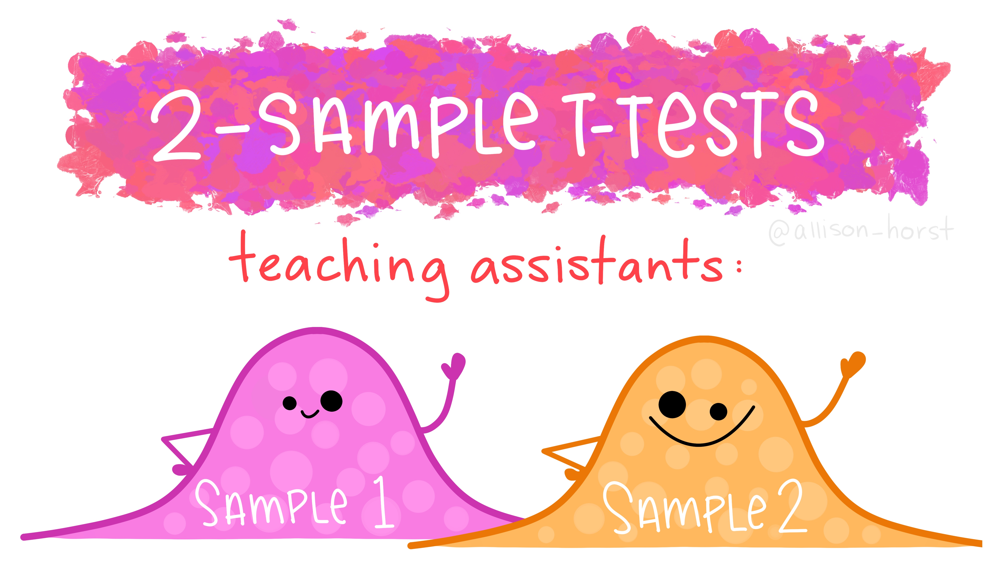

```{r setup, include=FALSE}
# R options
options(
  htmltools.dir.version = FALSE, # for blogdown
  show.signif.stars = FALSE,     # for regression output
  warm = 1
  )
# Set dpi and height for images
library(knitr)
opts_chunk$set(fig.height = 2.65, dpi = 300) 
# ggplot2 color palette with gray
color_palette <- list(gray = "#999999", 
                      salmon = "#E69F00", 
                      lightblue = "#56B4E9", 
                      green = "#009E73", 
                      yellow = "#F0E442", 
                      darkblue = "#0072B2", 
                      red = "#D55E00", 
                      purple = "#CC79A7")

options(htmltools.dir.version = FALSE)
knitr::opts_chunk$set(
	fig.align = "center",
	fig.height = 3.75,
	fig.width = 6.25,
	message = FALSE,
	warning = FALSE
)
```

```{r echo=FALSE, message=FALSE, warning=FALSE}
library(tidyverse)
library(infer)
library(countdown)
```

class: middle, center

### [Click for PDF of slides](02-review-ht.pdf)

---

### Announcements

- Complete [surveys and consent form](https://www2.stat.duke.edu/courses/Spring20/sta210.001/misc/jan8.html) by TODAY at 11:59p

- [Reading for next Wednesday](https://www2.stat.duke.edu/courses/Spring20/sta210.001/reading/reading-02.html)

- Labs start tomorrow! 

- No class Monday - Martin Luther King, Jr. Holiday

- Find more info about statistics related events on [Sakai](https://sakai.duke.edu)
    - Florida Blue visting Jan 22. [Submit resume](https://forms.office.com/Pages/ResponsePage.aspx?id=TsVyyzFKnk2xSh6jbfrJTFvPd3eQtCxBtEvbtkDole1UQlROM1hHRVVVV0xDRlFTMjdMOUJLNDFXVC4u) by today to be considered for interview during their visit

---

### Today's Agenda

- Calculating & interpreting hypothesis tests

- Drawing conclusions using hypothesis tests and confidence intervals
---

### *Sesame Street*

- *Sesame Street* is a television series designed to teach children ages 3-5 basic education skills such as reading (e.g. the alphabet) and math (e.g. counting)

- Today we are going to analyze data from an [study conducted by the Educational Testing Service](http://files.eric.ed.gov/fulltext/ED122799.pdf) in the early 1970s to test the  effectiveness of the program. 

```{r fig.align="center",out.width="50%",echo=FALSE}

```
---

### *Sesame Street* study

- Children from 6 locations around the United States (including Durham!) participated in the 26-week study. The children were split into two groups (`treatment`):
      + **Group 1**: Those who were encouraged to watch the show (assume watched regularly)
      + **Group 2**: Those who didn't get encouragement to watch the show (assume didn't watch regularly)

- Each child was given a test before and after the study to measure their knowledge of basic math, reading, etc.

- We will focus on the change in reading (identifying letters) scores (`change`)
<br><br>

<small>
[Sesame Street Data - Full Description](http://www2.stat.duke.edu/~jerry/sta210/sesamelab.html) 
Original Study: *Ann Bogatz, Gerry & Ball, Samuel. (1971). The Second Year of Sesame Street: A Continuing Evaluation. Volume 1. vols. 1 & 2.*
</small>

---

### Let's look at the data

`sesame_street.csv` is available in the datasets repo on GitHub.

```{r, echo = F}
sesame_street <- read_csv("data/sesame_street.csv")
```

```{r}
sesame_street %>%
  slice(1:10)
```

---

### Exploratory Data Analysis - Univariate

```{r echo = F}
ggplot(data = sesame_street, mapping = aes(x = change)) +
  geom_histogram(fill = "steelblue", color = "black") +
  labs(x = "Change in Reading Score (Post - Pre)" , 
       title = "Distribution of the Change in Reading Scores")
```

---

### Exploratory Data Analysis - Univariate

- Calculate summary statistics for `change`
<small>
```{r}
sesame_street %>%
  summarise(n = n(), min = min(change), median = median(change), max = max(change), 
            IQR = IQR(change), 
            mean = mean(change), std_dev = sd(change))
```
</small>

---

### 95% CI for mean change in reading score

The 95% confidence interval for the mean change in reading score is 

$$\mathbf{[9.384, 12.224]}$$


.question[

- Interpret the interval at http://bit.ly/sta210-sp20-CI-2

- Use **NetId@duke.edu** for your email address.

- You are welcome (and encouraged!) to discuss these questions with 1 - 2 people around you, but **each person** must submit a response.
]


```{r echo = F}
countdown(minutes = 3, seconds = 0, update_every = 5, warn_when = 30)
```

---

### Confidence Interval Recap

---

class: middle, center

### Hypothesis Tests

---

### Question we want to answer

- Let's focus on the children who were encouraged to watch *Sesame Street*

- In general, those children watched the show regularly, so let's see if the show impacted their reading skills

.alert[
The mean change in reading scores after 26 weeks for children ages 3 - 5 is 11.

Is there evidence that mean change in reading scores for children encouraged to watch *Sesame Street* is "significantly" different from the mean change in reading score for all children?
]

---

### Let's look at the data 

```{r echo = F, fig.height = 3}
sesame_street %>% 
  filter(treatment == "Encouraged") %>%
  ggplot(aes(x = change)) +
  geom_histogram() + 
  labs(x = "Change in Reading Score", 
       title = "Change in Reading Score", 
       subtitle = "for children encouraged to watch Sesame Street")
```
```{r echo = F}
sesame_street %>% 
  filter(treatment == "Encouraged") %>%
  summarise(n = n(), mean = mean(change), std_dev = sd(change))
```

---

### Outline of a Hypothesis Test

- Identify the parameter of interest. 

- Identify a null hypothesis, $H_0$, that represents the baseline

- Set an alternative hypothesis, $H_a$, that represents the research question, i.e. what you're testing

- Conduct a hypothesis test under the assumption that the null hypothesis is true and calculate a p-value
    - The <font class = "vocab">p-value</font> is the probability of getting the observed outcome or a more extreme outcome given the null hypothesis is true

---

### Outline of a Hypothesis Test

- Assess the p-value. A small p-value means...
    
    a. The assumed (null) hypothesis is incorrect
    
    b. The assumed (null) hypothesis is correct and a rare event has occurred
    
- State a conclusion about the hypothesis based on the assessment of the p-value
--

  - Since event (b) is by definition rare, we will conclude a <font color = "red">"small" p-value</font> indicates that there is <font color = "red">sufficient evidence to claim that the assumed hypothesis is false</font>.
      - In other words, the data are not consistent with the assumed hypothesis 

--

  - When the p-value is <font color = "blue"> "not small"</font>, we will conclude that there is <font color = "blue">not sufficient evidence</font> to claim the assumed hypothesis is false.


---

### Identify parameter & hypotheses

- <font class="vocab">Null hypothesis, $H_0$</font>: This is the baseline hypothesis, i.e. the "there is nothing going on" hypothesis. 
    - The mean change in reading score for children encouraged to watch the show is 11 (same as the mean for all children)
<br><br>

- <font class = "vocab">Alternative hypothesis, $H_a$</font>: This is typically what you want to show, i.e. the "there is something going on" hypothesis 
    - The mean change in reading score for children encouraged to watch the show not 11 (different from the mean for all children)
    
$$H_0: \mu = 11 \\
H_a: \mu \neq 11$$


---

### Distribution $\bar{x}$ under $H_0$

- We want to draw conclusions about $\mu$, so we'll use our best guess $\bar{x}$

- Recall from the Central Limit Theorem, when certain conditions are met (they are!), we know that 

$$\bar{x} \sim N\Big(\mu, \frac{\sigma}{\sqrt{n}}\Big)$$

--

- We conduct a hypothesis test under the assumption that $H_0$ is true, so for this test

$$\bar{x} \sim N\Big(11, \frac{\sigma}{\sqrt{n}}\Big)$$


---

### Distribution $\bar{x}$ under $H_0$

- We don't know $\sigma$, so we can use the standard error $s/\sqrt{n}$ to approximate $\sigma/\sqrt{n}$.

- Thus, putting it all together, we know 

$$\bar{x} \approx N\Big(11, \frac{10.7}{\sqrt{152}}\Big)$$

--

.alert[
Given $\bar{x} \approx N\Big(11, \frac{10.7}{\sqrt{152}}\Big)$, what is the probability of observing a mean change in score at least 1.5 points away from the center (11) in a random sample of 152 children ages 3 - 5?
]

---

### Visualize


```{r echo = F, fig.height = 3}
norm_sd <- 10.7 / sqrt(152)
lower = 11 - 3 * 10.7 / sqrt(152)
upper = 11 + 3 * 10.7 / sqrt(152)

ggplot(NULL, aes(c(lower,upper))) +
  geom_area(stat = "function", fun = dnorm, args = list(mean = 11, sd = norm_sd), fill = "#00998a", xlim = c(lower, 9.5)) +
  geom_area(stat = "function", fun = dnorm, args = list(mean = 11, sd = norm_sd), fill = "grey80", xlim = c(9.5, 12.5)) + 
  geom_area(stat = "function", fun = dnorm, args = list(mean = 11, sd = norm_sd), fill = "#00998a", xlim = c(12.5, upper)) +
  labs(x = "Sample Means", 
       title = "Approximate Distribution of the Sample Mean Under H0")
```


The shaded area represents the (approximate) probability of obtaining a sample mean at least as far away from the center as the one we observed given the true mean change is 11. 

---

### Test Statistic

- Let's quantify how "unusual" our observed sample mean is given $H_0: \mu = 11$ is true

- We'll begin by calculating how "far away" the observed mean is from the center of the distribution under $H_0$

- The .vocab[test statistic] is the number of standard errors the observed value is from the hypothesized value. The general form of the test statistic is 
$$ \frac{\text{observed value} - \text{hypothesized value}}{SE}$$

--

.alert[
$$t = \frac{\bar{x} - \mu_0}{\frac{s}{\sqrt{n}}} = \frac{12.5 - 11}{\frac{10.7}{\sqrt{152}}} \approx 1.728$$
where the test statistic follows the $t$ distribution with $n-1$ df
]

---

### Motivating the p-value 

- We got a test statistic of 1.728. In other words...

--

.alert[
Given $\bar{x} \approx N\Big(11, \frac{10.7}{\sqrt{152}}\Big)$, what is the probability of observing a mean change in score at least 1.5 points away from the center (11) in a random sample of 152 children ages 3 - 5?
]

--

$$\Large{\Downarrow}$$

--

.alert[
Given the $t$ distribution with 151 degrees of freedom, what is the probability of observing a test statistic with magnitude 1.728 or larger?
]

---

### p-value

Given the $t$ distribution with 151 degrees of freedom, what is the probability of observing a test statistic with magnitude 1.728 or larger?

```{r echo = F, fig.height = 3}
lower <- -3
upper <- 3
ggplot(NULL, aes(c(lower,upper))) +
  geom_area(stat = "function", fun = dt, args = list(151), fill = "#00998a", xlim = c(lower, -1.728)) +
  geom_area(stat = "function", fun = dt, args = list(151), fill = "grey80", xlim = c(-1.728, 1.728)) + 
  geom_area(stat = "function", fun = dt, args = list(151), fill = "#00998a", xlim = c(1.728, upper)) +
  labs(x = "t", 
       title = "Visualizing the p-value")
```

```{r}
(p_value <- 2 * pt(-1.728, 151))
```

---

### General guide for interpreting the p-value


|  Magnitude of p-value |             Interpretation            |
|:---------------------:|:-------------------------------------:|
| p-value < 0.01        | strong evidence against $H_0$         |
| 0.01 < p-value < 0.05 | moderate evidence against $H_0$       |
| 0.05 < p-value < 0.1  | weak evidence against $H_0$           |
| p-value > 0.1         | effectively no evidence against $H_0$ |
<br> 
<br>

**Note:** These are general guidelines. The strength of evidence depends on the context of the problem.

---

### Drawing the conclusion: Part 1

- A threshold can be used to decide whether or not to reject $H_0$ in favor of the alternative $H_a$

- This threshold is called the .vocab[significance level] and is usually denoted by $\alpha$

- If the p-value is less than $\alpha$, then we conclude there is sufficient evidence against $H_0$ and we **<u>reject</u> the null hypothesis**

- Otherwise, we conclude that there isn't sufficient evidence against $H_0$ and **<u>fail to reject</u> the null hypothesis**

---

### Don't just rely on p-values

- Do not rely strictly on the p-value and significance level to make a conclusion!
--

- Suppose the significance level is 0.05
--

  + If the p-value is 0.05001, we fail to reject $H_0$
--

  + If the p-value is 0.04999, we reject $H_0$
--

- 0.05001 and 0.04999 are practically the same, yet they led to different conclusions. 
--

.alert[
Use confidence intervals and other statistical summaries to provide more context about the results.
]

---

### t-test for *Sesame Street* data 

```{r}
enc <- sesame_street %>%
  filter(treatment == "Encouraged")

t.test(enc$change, mu = 11, conf.level = 0.9, 
       direction = "two.sided")
```

---

### In-class exercise 

.question[

- Answer the questions: http://bit.ly/sta210-sp20-ht

- Use **NetId@duke.edu** for your email address.

- You are welcome (and encouraged!) to discuss these questions with 1 - 2 people around you, but **each person** must submit a response.
]

```{r echo = F}
countdown(minutes = 4, seconds = 0, update_every = 5, warn_when = 30)
```

---

### Conclusion 

<center>
.alert[
p-value: 0.087

90% confidence interval: [11.059, 13.941]
]
</center>

- Using a significance level of 0.1, what is your conclusion from the test?
    - **This is the "statistical" conclusion from our test based on the mechanics of hypothesis testing.** 
    - In this case, we would reject $H_0$ and conclude there is sufficient evidence that the mean change in reading scores is not equal to 11 for those encouraged to watch *Sesame Street*.

---

### Conclusion 

<center>
.alert[
p-value: 0.087

90% confidence interval: [11.059, 13.941]
]
</center>

- Suppose you are advising a group of educators about whether they should spend additional time and money to encourage children to watch *Sesame Street*. Based on these results, would you advise the educators to spend the resources? Why or why not?
    - **This the "practical" conclusion from the test based on a combination of the results of the hypothesis test, the magnitude of the p-value, the confidence interval, business context, etc.**
    - There is no single correct answer to this question, but this is an example of the type of question we ultimately are trying to answer when we do statistical inference, i.e. this is statistial inference in practice.
    
---

### Inference for difference in means $\mu_1 - \mu_2$

By the Central Limit Throem, when [the conditions](https://www2.stat.duke.edu/courses/Spring20/sta210.001/slides/lec-slides/01-review-ci.html#39) are met, 

$$(\bar{x}_1 - \bar{x}_2) \sim N\left(\mu_1 - \mu_2, \sqrt{\frac{\sigma_1^2}{n_1} + \frac{\sigma_2^2}{n_2}} \right)$$

<br><br>

- We don't know $\sigma_1$ and $\sigma_2$ in practice, so we use the **standard error** in all calculations. 

$$SE (\bar{x}_1 - \bar{x}_2) = \sqrt{\frac{s_1^2}{n_1} + \frac{s_2^2}{n_2}}$$

---

### Inference for difference in means $\mu_1 - \mu_2$

**Confidence Interval** to estimate $\mu_1 - \mu_2$

$$(\bar{x}_1 - \bar{x}_2) \pm t_{df}^* \times \sqrt{\frac{s_1^2}{n_1} + \frac{s_2^2}{n_2}}$$

$t^*$ follows a $t$ distribution with [degrees of freedom](https://www2.stat.duke.edu/courses/Spring20/sta210.001/slides/lec-slides/01-review-ci.html#54) computed in R. 

---

### Inference for difference in means $\mu_1 - \mu_2$

**Hypothesis Test**: Is there a difference in the means between Group 1 and Group 2?

- Null hypothesis: $H_0: \mu_1 - \mu_2 = 0$
- Test statistic: 
  
  $$\frac{(\bar{x}_1 - \bar{x}_2) - 0}{\sqrt{\frac{s_1^2}{n_1} + \frac{s_2^2}{n_2}}}$$
  
- p-value: Calculated using the $t$ distribution with [degrees of freedom](https://www2.stat.duke.edu/courses/Spring20/sta210.001/slides/lec-slides/01-review-ci.html#54) computed in R. 

---

### Muddiest point - Optional

.question[

What is one question you have about hypohtesis testing and confidence intervals? 

Submit your question here: http://bit.ly/sta210-sp20-review

- Use **NetId@duke.edu** for your email address.

- Type "none" only if you really, really, really don't have a question
]


---

### Additional Resources

- Discussion in the scientific community about p-values: ["Scientists rise up against statistical significance" in *Nature*](https://www.nature.com/articles/d41586-019-00857-9)

- Fun review of two-sample tests by [@allison_horst](https://twitter.com/allison_horst):  https://twitter.com/allison_horst/status/1216411185240690688

```{r echo = F, out.width = "50%"}

```

---

### By Thursday at noon

- Make sure you are a member of the [course organization on GitHub](http://www.github.com/sta210-sp20)

- Make sure you have access to RStudio

- If you are using RStudio on your local machine, make sure you have git configured and you can knit a PDF (need a Latex editor installed)


