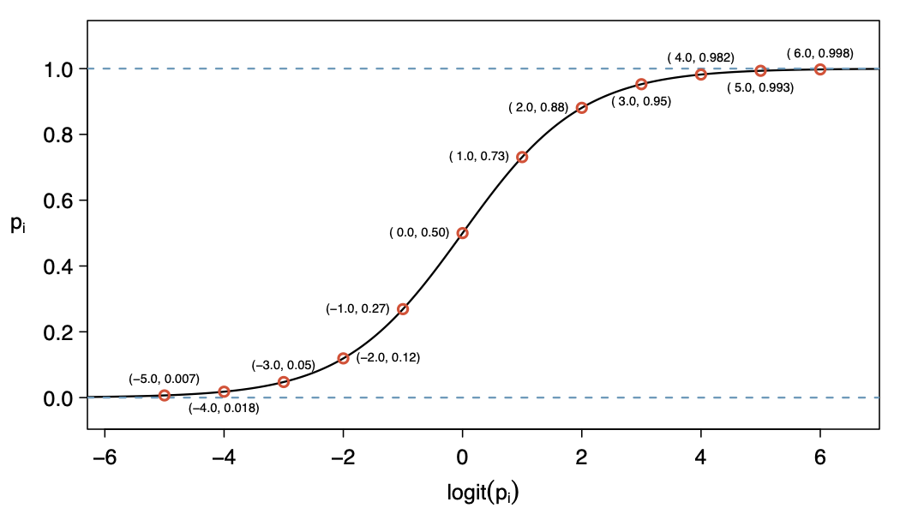

```{r setup, include=FALSE, echo=FALSE}
options(htmltools.dir.version = FALSE)
knitr::opts_chunk$set(
	fig.align = "center",
	fig.height =5,
	fig.width = 8,
	message = FALSE,
	warning = FALSE
)
```

class: middle, center

### [Click for PDF of slides](13-logistic-pt1.pdf)

```{r, echo=F}
library(tidyverse)
library(knitr)
library(broom)
library(fivethirtyeight)
```

---

class: middle, center

### Part I: Categorical Response Variables

---

### Quantitative vs. Categorical Response Variables

.vocab[Quantitative response variable]: 
- Sales price of a house in Levittown, NY
- **Model**: <font color = "blue"> mean sales price</font> given certain values of the predictor variables (`bedrooms`, `lot_size`, `year_built`, etc.) 

--

.vocab[Categorical response variable]: 
- Patient at risk of coronary heart disease (Yes/No)
- **Model**: <font color = "blue">probability a patient is at risk of coronary heart disease</font> given certain values of the predictor variables (`age`, `currentSmoker`, `cholesterol`, etc.)

---

### Models for categorical response variables

.pull-left[
.vocab[Logistic Regression]

2 Outcomes

Agree/Disagree
]

--

.pull-right[
.vocab[Multinomial Logistic Regression]

3+ Outcomes 

Strongly Agree, Agree, Disagree, Strongly Disagree
]

<br><br>

--

.center[
**Let's focus on logistic regression models for now.**
]

---

### FiveThirtyEight Live Win Probabilities

.pull-left[
```{r echo = F, fig.align = "center", out.width = '100%'}

```
]

.pull-right[
[FiveThirtyEight 2019: Sweet Sixteen Live Win Probabilities](https://projects.fivethirtyeight.com/2019-march-madness-predictions/)
]

<br>

*"These probabilities are derived using logistic regression analysis, which lets us plug the current state of a game into a model to produce the probability that either team will win the game.*
<br>
<div align="right">
- <a href=https://fivethirtyeight.com/features/how-our-march-madness-predictions-work-2/ target="_blank">"How Our March Madness Predictions Work"<a/>
</div>

---

### 2018 Election Forecasts

<center>
```{r, echo=FALSE,out.width = '70%'}
knitr::include_graphics("img/13/fivethirtyeight_senate.png")
```
<a href="https://projects.fivethirtyeight.com/2018-midterm-election-forecast/senate/?ex_cid=irpromo">FiveThirtyEight.com Senate forecast</a>
<br> 
<br>
<br>

```{r, echo=FALSE,out.width = '70%'}
knitr::include_graphics("img/13/fivethirtyeight_house.png")
```
<a href="https://projects.fivethirtyeight.com/2018-midterm-election-forecast/house/?ex_cid=irpromo">FiveThirtyEight.com House forecast</a>
</center>

---
class: middle, center

*Our models are probabilistic in nature; we do a lot of thinking about these probabilities, and the goal is to develop <font class="vocab">probabilistic estimates</font> that hold up well under real-world conditions.*
<br>
<div align="right">
<a href="https://fivethirtyeight.com/methodology/how-fivethirtyeights-house-and-senate-models-work/" target="_blank">-"How FiveThirtyEight's House, Senate, and Governor Models Work"<a/>
</div>

---

### Response Variable, $Y$ 

- $Y$ is a binary response variable 
  + 1: yes (success)
  + 0: no (failure)

--

- $\text{Mean}(Y) = \pi$
  + $\pi$ is the proportion of "yes" responses in the population
  + $\hat{\pi}$ is the proportion of "yes" responses in the sample 

--

- $\text{Variance}(Y) = \pi(1-\pi)$
  + Sample variance: $\hat{\pi}(1-\hat{\pi})$

--

- $\text{Odds(Y=1)} = \pi/(1-\pi)$
  + Sample odds: $\hat{\pi}/(1-\hat{\pi})$

---

### Odds

- Given $\pi$, the population proportion of "yes" responses (i.e. "success"), the corresponding <font class="vocab3">odds</font> of a "yes" response is 

$$\omega = \frac{\pi}{1-\pi}$$


- The *sample odds* are $\hat{\omega} = \frac{\hat{\pi}}{1-\hat{\pi}}$

--

- Ex: Suppose the sample proportion $\hat{\pi} = 0.3$. Then, the sample odds are 
$$\hat{\omega} = \frac{0.3}{1-0.03} = 0.4286$$

---

### Properties of the odds

- $\text{odds} \geq 0$

--

- If $\pi = 0.5$, then odds $= 1$

--

- If odds of "yes" $=\omega$, then the odds of "no" $=\frac{1}{\omega}$

--

- If odds of "yes" $=\omega$, then $\pi = \frac{\omega}{(1+\omega)}$

---

### Risk of coronary heart disease 

This dataset is from an ongoing cardiovascular study on residents of the town of Framingham, Massachusetts. The goal is to predict whether a patient has a 10-year risk of future coronary heart disease.

**Response**: 

.vocab[`TenYearCHD`]: 
- 0 = Patient is not high risk of having coronary heart disease in the next 10 years 
- 1 = Patient is high risk of having coronary heart disease in the next 10 years 

**Predictors**: 

- .vocab[`age`]: Age at exam time.
- .vocab[`currentSmoker`]: 0 = nonsmoker; 1 = smoker
- .vocab[`totChol`]: total cholesterol (mg/dL)


```{r echo = F}
heart_data <- read_csv("data/framingham.csv") %>%
  drop_na() %>%
  mutate(currentSmoker = as.factor(currentSmoker), 
         TenYearCHD = as.factor(TenYearCHD), 
         ageCent = age - mean(age), 
         totCholCent = totChol - mean(totChol))
```

---

### Response Variable, `TenYearCHD`

```{r echo = F}
heart_data %>%
  count(TenYearCHD) %>%
  mutate(proportion  = n/sum(n))
```

```{r echo = F}
phat <- heart_data %>%
  count(TenYearCHD) %>%
  mutate(proportion  = n/sum(n)) %>%
  filter(TenYearCHD == 1) %>%
  select(proportion) %>%
  pull() %>% round(3)
```

- $\hat{\pi}$ = `r phat`

--

- Sample variance = 0.152 * (1- 0.152) =  `r phat*(1-phat)`

--

- Odds(Y = 1) = 0.152/(1 - 0.152) =  `r phat/(1-phat)`

--

- Odds(Y = 0) = 1 / 0.1792453 = `r (1-phat)/phat`

---

### Let's incorporate more variables 

- We want to use information about a patient's age, cholesterol, and whether or they are a smoker to understand the probability they're high risk of having coronary heart disease.

- To do this, we need to fit a model! 

---

### Consider possible models 

- $y$: Whether a patient in the sample is high risk of having coronary heart disease.
--

- $\pi_i = P(y_i = 1 | \text{age}_i, \text{currentSmoker}_i, \text{totChol}_i)$: probability a patient $i$ is high risk  for coronary heart disease given their age, smoking status, and total cholesterol 

--

.question[
.small[
Let's consider fitting a multiple linear regression model. Below are 3 possible response variables. For each response variable, briefly explain why a multiple linear regression model is <u>**not**</u> appropriate.

**Model 1**: $\hat{y}_i = \hat{\beta}_0 + \hat{\beta}_1 \text{age} + \hat{\beta}_2 \text{currentSmoker} + \hat{\beta}_3 \text{totChol}$

**Model 2**: $\hat{\pi}_i = \hat{\beta}_0 + \hat{\beta}_1 \text{age} + \hat{\beta}_2 \text{currentSmoker} + \hat{\beta}_3 \text{totChol}$

**Model 3**: $\widehat{\log(\pi)}_i = \hat{\beta}_0 + \hat{\beta}_1 \text{age} + \hat{\beta}_2 \text{currentSmoker} + \hat{\beta}_3 \text{totChol}$
]
]

---

class: middle, center

### Part 2: Basics of logistic regression

---

### Logistic Regression Model 

- Suppose $P(y_i = 1|x_i) = \pi_i$ and $P(y_i = 0|x_i) = 1 - \pi_i$

- The <font class="vocab3">logistic regression model </font> is

$$\log\Big(\frac{\pi_i}{1-\pi_i}\Big) = \beta_0 + \beta_1 x_i$$
<br> 


- $\log\Big(\frac{\pi_i}{1-\pi_i}\Big)$ is called the <font class="vocab3">logit</font> function

---

### Logit function 

$$0 \leq \pi \leq 1 \hspace{5mm} \Rightarrow \hspace{5mm} -\infty < 
\log\Big(\frac{\pi}{1-\pi}\Big) < \infty$$

```{r  echo = F, fig.align = "center", fig.cap="OpenIntro Statistics, 4th ed (pg. 373)"}

```

---

### Interpreting the intercept: $\beta_0$

.alert[
$$\log\Big(\frac{\pi_i}{1-\pi_i}\Big) = \beta_0 + \beta_1 x_i$$
]

--

- When $x=0$, log-odds of $y$ are $\beta_0$
    - Won't use this interpretation in practice

- **When $x=0$, odds of $y$ are $\exp\{\beta_0\}$**

---

### Interpreting slope coefficient $\beta_1$

.alert[
$$\log\Big(\frac{\pi_i}{1-\pi_i}\Big) = \beta_0 + \beta_1 x_i$$
]

If $x$ is a <u>quantitative</u> predictor

- As $x_i$ increases by 1 unit, we expect the log-odds of $y$ to increase by $\beta_1$

- **As $x_i$ increases by 1 unit, the odds of $y$ multiply by a factor of $\exp\{\beta_1\}$**

--

If $x$ is a <u>categorical</u> predictor. Suppose $x_i = k$

- The difference in the log-odds between group $k$ and the baseline is $\beta_1$
- **The odds of $y$ for group $k$ are $\exp\{\beta_1\}$ times the odds of $y$ for the baseline group.**

---

### Inference for coefficients

- The standard error is the estimated standard deviation of the sampling distribution of $\hat{\beta}_1$

- We can calculate the $\color{blue}{C%}$ <font color="blue">confidence interval</font> based on the large-sample Normal approximations

- **CI for $\boldsymbol{\beta}_1$**: $$\hat{\beta}_1 \pm z^* SE(\hat{\beta}_1)$$

.alert[
**CI for $\exp\{\boldsymbol{\beta}_1\}$**: $$\exp\{\hat{\beta}_1 \pm z^* SE(\hat{\beta}_1)\}$$
  ]

---

### Estimating the coefficients

- Estimate coefficients using **maximum likelihood estimation**

- <font class="vocab">Basic Idea: </font>
  + Find values of $\beta_0$ and $\beta_1$ that make observed values of $y$ the most likely to have occurred
  + More details pg. 156 - 157 of the textbook

- We will fit logistic regression models using R

---

### Modeling risk of coronary heart disease

Let's use the mean-centered variables for `age` and `totChol`. 

```{r echo = F}
risk_m <- glm(TenYearCHD ~ ageCent + currentSmoker + totCholCent, data = heart_data, 
         family = binomial)
tidy(risk_m, conf.int = TRUE) %>% kable(format = "markdown", digits = 3)
```

$$\small{\log\Big(\frac{\hat{\pi}}{1-\hat{\pi}}\Big) = -2.111 + 0.081 \text{ageCent} + 0.447 \text{currentSmoker} + 0.003 \text{totChol}}$$

---

### Modeling risk of coronary heart disease

$$\small{\log\Big(\frac{\hat{\pi}}{1-\hat{\pi}}\Big) = -2.111 + 0.081 \text{ageCent} + 0.447 \text{currentSmoker} + 0.003 \text{totChol}}$$

.question[
Use the model to interpret the following. Write all interpretations in terms of the odds of a patient being high risk for coronary heart disease.

1. Interpret the intercept.
2. Interpret `ageCent` and it's 95% confidence interval.
3. Interpret `currentSmoker1` and it's 95% confidence interval.
]
