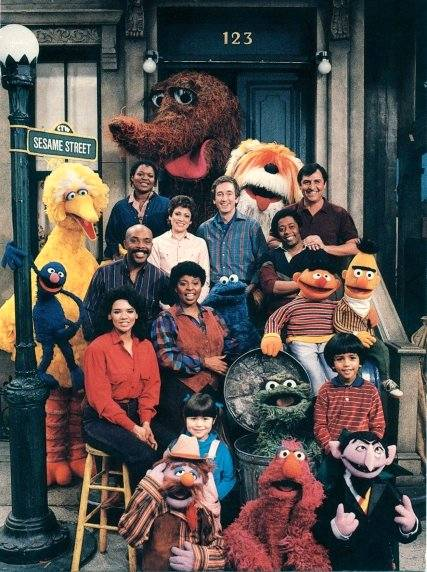

```{r setup, include=FALSE, echo=FALSE}
options(htmltools.dir.version = FALSE)
knitr::opts_chunk$set(
	fig.align = "center",
	fig.height = 5.5,
	fig.width = 10,
	message = FALSE,
	warning = FALSE
)
```

class: middle, center

### [Click for PDF of slides](21-multinomial-logistic-pt3.pdf)
---

### Announcements

- Lab 09 due Tuesday at 11:59p

- Project Regression Analysis due Wed, Nov 20 at 11:59p

```{r, echo = F}
library(tidyverse)
library(knitr)
library(broom)
```

---

### HW 05: Interpreting interaction term 

- .vocab[Response ]: `log_odds_removed`

```{r echo = F}
moth <- read_csv("data/moth.csv")
moth <- mutate(moth, notremoved = PLACED - REMOVED, 
               log_odds_removed = log(REMOVED / notremoved),
               prop_removed = REMOVED / PLACED, 
               dark = ifelse(MORPH=="dark",1,0), 
               distance = DISTANCE, 
               morph = MORPH)
```

```{r echo=F}
model1 <- lm(log_odds_removed ~ distance + morph + distance * morph, data = moth)
tidy(model1) %>% select(term, estimate) %>%
  kable(format = "markdown", digits = 3)
```

.question[
.small[
*"For every 1 km increase in distance, the log-odds that a light moth is removed from the tree trunk is (-0.028 + 0.018) = -0.01 times the log-odds of a dark moth being removed from the tree trunk."*

1. Why is this interpretation incorrect?
2. Rewrite the interpretation of the interaction effect in terms of `log_odds_removed`. 
]
]

---
### HW 05: Interpreting interaction term 
 
```{r echo=F}
model1 <- lm(log_odds_removed ~ distance + morph + distance * morph, data = moth)
tidy(model1) %>% select(term, estimate) %>%
  kable(format = "markdown", digits = 3)
```

.question[
1. Write the interpretation of the interaction effect in terms of the **odds** a moth is removed.
]

---

class: middle, center

### Multinomial Logistic Regression

---

### Practice: *Sesame Street*

- We will analyze data from an [experiment by the Educational Testing Service](http://files.eric.ed.gov/fulltext/ED122799.pdf) to test the effectiveness of the children's program *Sesame Street*, an educational program designed to teach young children basic educational skills such as counting and the alphabet

- As part of the experiment, children were assigned to one of two groups: those who were encouraged to watch the program and those who were not

- The show is only effective if children watch it, so we want to understand what effect the encouragement had on the frequency of viewing after adjusting for other characteristics


---

### Response Variable

.pull-left[ 

<font class="vocab">`viewcat`</font>
  + 1: rarely watched show
  + 2: once or twice a week
  + 3: three to five times a week
  + 4: watched show on average more than five times a week
]

.pull-right[
```{r echo = F}

```
]
.small[[*In pictures: The early years of 'Sesame Street'*]( https://www.cnn.com/2019/11/10/entertainment/gallery/sesame-street-early-years/index.html)
]
---

### Predictor Variables

- <font class="vocab">`age`:</font> child's age in months
- <font class="vocab">`prenumb`: </font>score on numbers pretest (0 to 54)
- <font class="vocab">`prelet`: </font>score on letters pretest (0 to 58)
- <font class="vocab">`viewenc`:</font> 1: encouraged to watch, 2: not encouraged
- <font class="vocab">`site:`</font>
  + 1: three to five year old from urban area
  + 2: four year old from suburban area
  + 3: from rural area with high socioeconomic status
  + 4: from rural area with low socioeconomic status
  + 5: from Spanish speaking home

.footnote[[Full data description](http://www2.stat.duke.edu/~jerry/sta210/sesamelab.html)]

---

### Analysis 

- Make a copy of the **Sesame Street** project in RStudio Cloud

- Make sure your group's answers are recorded in one team member's RStudio Cloud project.
  - At the top of the project, write the names of the members' who are working on the appex. 
  - Submit the name of the team member recording the responses: https://forms.gle/pN6k1M8J3twXwThs6

- Other team members can follow along in RStudio Cloud or using the [instructions](https://www2.stat.duke.edu/courses/Fall19/sta210.001/appex/21-multinomial-logistic.html). 


