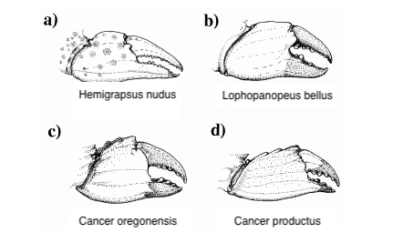

```{r setup, include=FALSE, echo=FALSE}
options(htmltools.dir.version = FALSE)
knitr::opts_chunk$set(
	fig.align = "center",
	fig.height = 4,
	fig.width = 7,
	message = FALSE,
	warning = FALSE
)
```


```{r,echo=F}
library(Sleuth3)
library(knitr)
library(broom)
library(tidyverse)
library(arm)
library(nnet)
```

class: middle, center

### [Click for PDF of slides](24-exam-02-review.pdf)

---

## Announcements

- HW 06 due **today at 11:59p**

- Project regression analysis due **today at 11:59p**

- Thursday's Lab: Exam 02 office hours


---

## Exam 02 Outline

- Mostly short answer questions

- Permitted to bring one sheet of **<u>handwritten</u>** notes (front and back)
  + I will check your notes when you turn in your exam
  
- Calculator **not** permitted on exam

- Please use black or blue pen (and write neatly!)

---

### How to prepare 

- Review lecture notes and readings

- Review HW and lab assignments

- Practice problem sets on Sakai

- Utilize office hours and help hours during lab

- Study while making your page of notes

---

## Topics 

- **Review:** Multiple Linear Regression 

- **Models**: 
    - Logistic Regression
    - Multinomial Logistic Regression
    - Poisson Regression (main ideas, no zero-inflated poisson)
--

- Model Selection

- Modeling in practice 
    - Model validation (main ideas, why it's important)
    - Dealing with missing data (main ideas, why it's important)


---

## Logistic Regression

- Use for response variable $y$ that is categorical with 2 levels 

$$\log\Big(\frac{\hat{p}_i}{1-\hat{p}_i}\Big) = \hat{\beta}_0 + \hat{\beta}_1 x_i + \dots + \hat{\beta}_p x_p $$

- <font class="vocab">Slope:</font>  As $x_j$ increases by 1 unit, the odds of $y$ are expected to multiply by a factor of $\exp\{\beta_j\}$, holding all else constant

- <font class="vocab">Intercept: </font> When $x_1 = \dots x_p =0$, odds of $y$ are expected to be $\exp\{\beta_0\}$

---

## Multinomial Logistic Regression

- Use for response variable that is categorical with more than 2 levels
  
-  Suppose we have a categorical variable with $k > 2$ levels. Let $y=1$ be the baseline category

$$\log\bigg(\frac{\hat{p}_{2}}{\hat{p}_{1}}\bigg) = \hat{\beta}_{02} + \hat{\beta}_{12} x_1 + \dots + \hat{\beta}_{p2} x_p \\
\vdots \\
\log\bigg(\frac{\hat{p}_{k}}{\hat{p}_{1}}\bigg) = \hat{\beta}_{0k} + \hat{\beta}_{1k} x_1 + \dots + \hat{\beta}_{pk} x_p$$

- <font class="vocab">Slope</font>: When $x$ increases by one unit, the odds of $y=k$ versus $y=1$ are expected to multiply by a factor of $\exp\{\hat{\beta}_{1k}\}$, holding all else constant.

- <font class="vocab">Intercept</font>: When $x_1 = \dots x_p =0$, the odds of $y=k$ versus $y=1$ are expected to be $\exp\{\hat{\beta}_{0k}\}$

---

## Model Selection

- Consider the main objective:
  + Prediction
  + Adjusting for many variables
  + Explanation
  
- Forward, backward, stepwise selection
  + Optimize some criteria at each step
  
- *Example*: Minimize **AIC** = $n\log(SSE)−n\log(n)+2(p+1)$

---

class: middle, center

## Questions? 

---

## Data Description 

- We would like to identify crab species based on the closing force and propodus height of claws
  + `ex0722` data set in the `Sleuth3` R package

- **Predictors:** 
  + <font class="vocab">Force: </font> Closing force of claw (newtons)
  + <font class="vocab">Height: </font> Propodus height (mm)
  
- **Response:**
  + <font class="vocab">Species: </font> Hemigrapsus nudus (Hn), Lophopanopeus bellus (Lb), Cancer productus (Cp)

---

## Data Description 

.center[
```{r, echo=FALSE,out.width = '80%'}

```
]

Source: Yamada, S. and Boulding E., 1998, Claw morphology, prey size selection and foraging efficiency in generalist and specialist shell-breaking crabs, *Journal of Experimental Marine Biology and Ecology*, 220: 191-211.

---

class: middle, center

[Exam 02 review questions](https://www2.stat.duke.edu/courses/Fall19/sta210.001/appex/24-exam-02-review.html)

