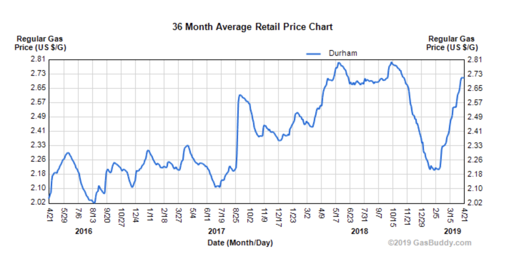
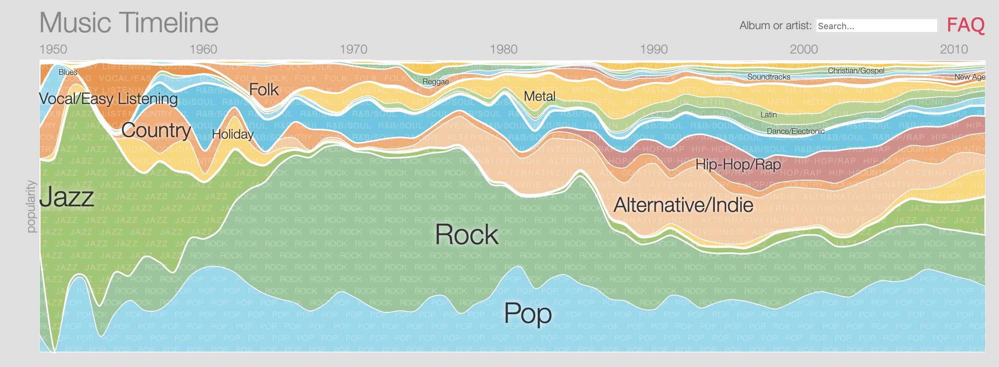

```{r setup, include=FALSE, echo=FALSE}
options(htmltools.dir.version = FALSE)
knitr::opts_chunk$set(
	fig.align = "center",
	fig.height = 4,
	fig.width = 7,
	message = FALSE,
	warning = FALSE
)
```

class: middle, center

### [Click for PDF of slides](25-time-series.pdf)

---

### Announcements


- Project write up due Dec 10 at 11:59p

- Project presentations on Dec 11
    - Lab 01L: 9a - 10:30a
    - Lab 02L: 10:30a - 12p
    
- Regression analysis feedback and grades by Wednesday
    
- Exam 2 grades by next Monday

- Exam 2 extra credit:
  + 90% response rate on course eval: +1 pt on Exam 02 grades

```{r,echo=F}
library(tidyverse)
library(cowplot)
library(tidyr)
library(knitr)
library(broom)
library(forecast)
library(fpp2)
```

---

class: middle, center


## Examples of Time Series Data

---

## Gas Prices in Durham
 
.center[
```{r, echo=FALSE,out.width = '90%'}

```

[https://www.gasbuddy.com/Charts](https://www.gasbuddy.com/Charts)
]

---

## Apple's Stock 

.center[


[Apple's Stock Price](https://www.google.com/search?rlz=1C5CHFA_enUS812US814&tbm=fin&q=NASDAQ:+AAPL&stick=H4sIAAAAAAAAAONgecRoyi3w8sc9YSmdSWtOXmNU4-IKzsgvd80rySypFJLgYoOy-KR4uLj0c_UNzKtyk8rSeADviEaCOgAAAA&biw=1219&bih=1169#scso=_zp_YW7edDdGxggeTqLqYCw1:0)

]
---

class: middle, center

## Google Music Timeline

.center[


[http://research.google.com/bigpicture/music/](http://research.google.com/bigpicture/music/)
]

---

## Retail Sales: 1999 - 2011

- <font class="vocab">Goal:</font> Understand the change in total online sales from the fourth quarter of 1999 (Q4 1999) to the first quarter of 2011 (Q1 2011). The data may be found on the [textbook website](http://people.stern.nyu.edu/jsimonof/RegressionHandbook/Data/Excel/). It is originally from the U.S. Census Bureau. 

<br>

```{r echo = F}
ecommerce <- read_csv("data/ecommerce.csv") %>%
  rename(total_sales = `Total sales`, 
         online_sales = `e-Commerce sales`, 
         q1 = `Quarter 1`, 
         q2 = `Quarter 2`, 
         q3 = `Quarter 3`, 
         q4 = `Quarter 4`) %>%
    mutate(quarter = case_when(
  q1 == 1  ~ "Q1", 
  q2 == 1  ~ "Q2", 
  q3 == 1  ~ "Q3", 
  q4 == 1  ~ "Q4"), 
  index = 1:n(), 
  Recession = as.factor(Recession))
```

- .vocab[`online_sales`]: Total online sales (in US dollars)
- .vocab[`total_sales`]: Total retail sales (in US dollars)

---

### Make a `ts` object

```{r}
online_ts <- ts(ecommerce$online_sales, 
                start = c(1999,4), #start in Q4 1999
                frequency = 4) #time periods are quarterly
```

```{r}
online_ts
```

---

### Plot online sales

```{r}
autoplot(online_ts) +
  labs(title = "Total Online Sales", 
       subtitle = "Q4 1999 - Q1 2011", 
       y = "Total Online Sales (in US dollars)")
```

---

### Trends and seasonality
.pull-left[
- .vocab[Trending]: General movement in the data (increasing or decreasing)
    - Rescale variables so they are comparable over time (e.g. per capita variables)
    - Add **time** variables to the model 

- .vocab[Seasonality]: Effects due to the season (e.g. sales during holidays)
    - Include indicator variables for the season 
]

.pull-right[

```{r echo = F}
autoplot(online_ts) +
  labs(title = "Total Online Sales", 
       subtitle = "Q4 1999 - Q1 2011", 
       y = "Total Online Sales (in US dollars)")
```
.alert[
Remove trends and seasonality, so you can focus on the relationships between the variables of interest
]
]


---

### Online sales vs. total sales

```{r}
ggplot(data = ecommerce , aes(x = total_sales, y = online_sales)) +
  geom_point() + 
  labs(title = "Online sales vs. total sales", 
       x = "Total Sales (in US Dollars)", 
       y = "Online Sales (in US Dollars)")
```

---

### Online sales vs. total sales

```{r echo = F}
m1 <- lm(online_sales ~ total_sales, data = ecommerce)
tidy(m1) %>%
  kable(format = "markdown", digits = 3)
```

<br><br>

```{r, echo = F}
glance(m1) %>% 
  select(r.squared, adj.r.squared) %>%
  kable(format = "markdown", digits = 3)
```


---

### Initial residuals plots

```{r echo = F, fig.width = 20}
m1_aug <- augment(m1) %>%
  mutate(index = 1:n()) %>%
  inner_join(ecommerce, by = "index")

resid_ts <- ts(m1_aug$.std.resid,
                start = c(1999,4), #start in Q4 1999
                frequency = 4)
```

```{r echo = F}
p1 <- autoplot(resid_ts) +
  geom_hline(yintercept = 0, color = "red") +
  geom_point() +
  labs(title = "Standardized residuals over time", 
       y = "Standardized residuals")

p2 <- ggplot(data = m1_aug, aes(x = quarter, y = .std.resid)) +
  geom_boxplot() +
  geom_hline(yintercept = 0, color = "red") + 
  labs(title = "Standardized Residuals vs. Quarter",  
       x = "Quarter", 
       y = "Standardized Residuals")

cowplot::plot_grid(p1, p2, ncol = 2)
```

<br><br>

.question[
What do you learn from these residual plots?
]
---

## Time Series

- One assumption for the regression methods we've used so far is that the observations are independent of one another
    + In other words, the residuals are independent 


- When data is ordered over time, errors in one time period may influence error in another time period


- We'll use <font class = "vocab">time series analysis</font> to deal with this serial correlation
    + Assume the observations are measured at equally spaced time points

- Today's class is a brief introduction to time series analysis
  + *STA 444: Statistical Modeling of Spatial and Time Series Data* for more in-depth study of the subject

---

## Autocorrelation

- We want a measure of the correlation between the observation at time $t$ and the observation at time $t-k$
    + $k$ is the **lag**

- To do so, we will compute the correlation between the observations (or  residuals) at time $t$ and time $t-k$
    - This is the **autocorrelation coefficient**

- The formula for the <font class="vocab">Lag <i>k</i> autocorrelation coefficient is </font>

.alert[
$$\hat{\rho}_k = \frac{\sum_{i=k+1}^{n}e_ie_{i-k}}{\sum_{i=1}^n e_i^2} = \frac{\sum_{i=k+1}^{n}(y_i - \bar{y})(y_{i-k} - \bar{y})}{\sum_{i=1}^n (y_i - \bar{y})^2}$$
]

---

### Online Sales: Autocorrelation

- We can use the <font class="vocab">`ggAcf()`</font> function in the **forecast** package to calculate the autocorrelation coefficient


```{r}
ggAcf(resid_ts)
```


---

### Add `quarter` to the model 

One way to deal with seasonality is to add indicator variables to the model

```{r echo = F}
m2 <- lm(online_sales ~ total_sales + quarter, data = ecommerce)
tidy(m2) %>% 
  kable(format = "markdown", digits = 3)
```

<br><br>

```{r echo = F}
glance(m2) %>%
  select(r.squared, adj.r.squared) %>%
  kable(format = "markdown", digits = 3)
```

---

### Updated residual plots

```{r echo = F}
m2_aug <- augment(m2)

m2_resid_ts <- ts(m2_aug$.std.resid,
                start = c(1999,4), #start in Q4 1999
                frequency = 4)
```

```{r echo = F}
p1 <- autoplot(m2_resid_ts) +
  geom_hline(yintercept = 0, color = "red") +
  geom_point() +
  labs(title = "Standardized residuals over time", 
       y = "Standardized residuals")

p2 <- ggplot(data = m2_aug, aes(x = quarter, y = .std.resid)) +
  geom_boxplot() +
  geom_hline(yintercept = 0, color = "red") + 
  labs(title = "Standardized Residuals vs. Quarter",  
       x = "Quarter", 
       y = "Standardized Residuals")

p3 <- ggAcf(m2_resid_ts)

cowplot::plot_grid(p1, p2, p3, ncol = 2)
```

.question[
- What event happened in late 2008 that can possibly explain the large jump in the residuals?
- What do the high residuals tell you about online sales during this time period?
]

---

### Account for the recession 

```{r}
ecommerce %>%
  filter(Recession == 1) %>%
  select(Quarter)
```

---

### Add `Recession` to the model

```{r echo = F}
m3 <- lm(online_sales ~ total_sales + quarter + Recession, data = ecommerce)
tidy(m3) %>% 
  kable(format = "markdown", digits = 3)
```

<br><br>

```{r echo = F}
glance(m3) %>%
  select(r.squared, adj.r.squared) %>%
  kable(format = "markdown", digits = 3)
```

---

### Residual Plots

```{r echo = F}
m3_aug <- augment(m3)

m3_resid_ts <- ts(m3_aug$.std.resid,
                start = c(1999,4), #start in Q4 1999
                frequency = 4)
```

```{r echo = F}
p1 <- autoplot(m3_resid_ts) +
  geom_hline(yintercept = 0, color = "red") +
  geom_point() +
  labs(title = "Standardized residuals over time", 
       y = "Std. resid.")

p2 <- ggplot(data = m3_aug, aes(x = quarter, y = .std.resid)) +
  geom_boxplot() +
  geom_hline(yintercept = 0, color = "red") + 
  labs(title = "Standardized Residuals vs. Quarter",  
       x = "Quarter", 
       y = "Std. resid.")

p3 <- ggplot(data = m3_aug, aes(x = Recession, y = .std.resid)) +
  geom_boxplot() +
  geom_hline(yintercept = 0, color = "red") + 
  labs(title = "Standardized Residuals vs. Recession",  
       x = "Recession", 
       y = "Std. resid.")

p4 <- ggAcf(m3_resid_ts)

cowplot::plot_grid(p1, p2, p3, p4, ncol = 2)
```

<br>

.alert[
There is still some seasonality that isn't accounted for by the model. A more complex "deseasonalizing" method such as using yearly lags and moving averages may be required for this data. This is typically what is used by the U.S.Census Bureau when analyzing economic data. 
]

---

class: middle, center

### Autoregressive Model 

---

## Autoregressive Model

- One way to deal with serial correlation is to use values of the response from previous time periods as a predictor in the model

- This is the basic structure of the <font class="vocab">autoregressive (AR) model</font>

- The AR model with one lag, the <font class="vocab3">AR(1) model</font>, is

$$y_i = \beta_0 + \beta_1 x_{1i} + \dots + \beta_p x_{pi} + \beta_{p+1} y_{i-1} + \epsilon_i \hspace{10mm} \epsilon_i \sim N(0,\sigma^2)$$
- Further lags, $y_{i-2}$, $y_{i-3}$, etc. can also be used. 
    - Use the ACF plot to determine the lags to use in the model. 
    
---

### Online sales: Create lagged variable

- Create variable of online sales lagged by 1 time period

```{r}
ecommerce <- ecommerce %>%
  mutate(online_sales_lag1 = lag(online_sales, n = 1)) 
```

```{r}
ecommerce %>%
  select(online_sales, online_sales_lag1) %>%
  slice(1:5)
```

---

### Online sales: AR(1) model

```{r}
ar_1_model <- lm(online_sales ~ total_sales + online_sales_lag1, 
                 data = ecommerce)
```

```{r echo = F}
tidy(ar_1_model) %>% kable(format = "markdown", 
                           digits = 3)
```

---

### Residual plots 

```{r echo = F}
ar1_aug <- augment(ar_1_model)

ar1_resid_ts <- ts(ar1_aug$.std.resid,
                start = c(1999,4), #start in Q4 1999
                frequency = 4)
```

```{r echo = F}
p1 <- autoplot(ar1_resid_ts) +
  geom_hline(yintercept = 0, color = "red") +
  geom_point() +
  labs(title = "Standardized residuals over time", 
       y = "Std. resid.")

p2 <- ggAcf(ar1_resid_ts)

cowplot::plot_grid(p1, p2, ncol = 2)
```

---

### Add `quarter` to the AR(1) model

```{r}
ar_1_m2 <- lm(online_sales ~ total_sales + quarter + 
                online_sales_lag1, 
                 data = ecommerce)
```

<br><br>

```{r echo = F}
tidy(ar_1_m2) %>% kable(format = "markdown", 
                           digits = 3)
```

```{r echo = F}
glance(ar_1_m2) %>%
  select(r.squared, adj.r.squared) %>%
  kable(format = "markdown", digits = 3)
```


---

### Updated residual plots 

```{r echo = F}
ar1_m2_aug <- augment(ar_1_m2)

ar1_m2_resid_ts <- ts(ar1_m2_aug$.std.resid,
                start = c(1999,4), #start in Q4 1999
                frequency = 4)
```

```{r echo = F}
p1 <- autoplot(ar1_m2_resid_ts) +
  geom_hline(yintercept = 0, color = "red") +
  geom_point() +
  labs(title = "Standardized residuals over time", 
       y = "Std. resid.")

p2 <- ggplot(data = ar1_m2_aug, aes(x = quarter, y = .std.resid)) +
  geom_boxplot() +
  geom_hline(yintercept = 0, color = "red") + 
  labs(title = "Standardized Residuals vs. Quarter",  
       x = "Quarter", 
       y = "Std. resid.")

p3 <- ggAcf(ar1_m2_resid_ts)

cowplot::plot_grid(p1, p2, p3, ncol = 2)
```

.alert[
We have improved upon the previous models, but there is still some seasonality that isn't accounted for by the model. As stated before, a more complex "deseasonalizing" method such as using yearly lags and moving averages is required for this data.
]

---

### Interpretation 

```{r echo = F}
tidy(ar_1_m2) %>% kable(format = "markdown", 
                           digits = 3)
```

.question[
- Interpret `total_sales` in context of the data. 
- Interpret `online_sales_lag1` in context of the data.
- Interpret the intercept in context of the data. Is the intercept meaningful? 
]

---

## Further Reading

- [*Handbook of Regression Analysis*](https://sakai.duke.edu): Chapter 5

- [*Time Series: A Data Analysis Approach*](https://www.stat.pitt.edu/stoffer/tsda/) by Shumway and Stoffer 
    - introductory text
    
- [*Time Series Analysis and Its Applications*](https://www.stat.pitt.edu/stoffer/tsa4/) by Shumway and Stoffer
    - graduate-level text
    - freely available online
    


