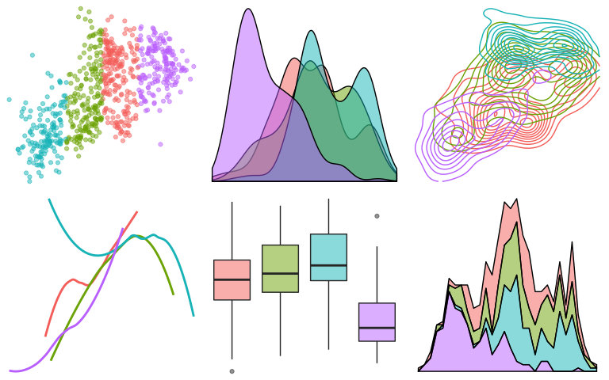

website-graphics
================
Dr. Maria Tackett
12.17.2018

This document contains the code required to make the background images for the STA 199 course webiste. The data used for this background is the [Capital Bikeshare dataset](https://archive.ics.uci.edu/ml/datasets/bike+sharing+dataset), obtained from the UCI Machine Learning Repository.

``` r
library(tidyverse)
```

    ## ── Attaching packages ──────────────────────────────────────────────────────────── tidyverse 1.2.1 ──

    ## ✔ ggplot2 3.0.0     ✔ purrr   0.2.5
    ## ✔ tibble  1.4.2     ✔ dplyr   0.7.6
    ## ✔ tidyr   0.8.1     ✔ stringr 1.3.1
    ## ✔ readr   1.1.1     ✔ forcats 0.3.0

    ## ── Conflicts ─────────────────────────────────────────────────────────────── tidyverse_conflicts() ──
    ## ✖ dplyr::filter() masks stats::filter()
    ## ✖ dplyr::lag()    masks stats::lag()

``` r
library(readr)
```

``` r
bikeshare <- read_csv("https://raw.githubusercontent.com/matackett/data/master/capital-bikeshare.csv")                          
```

    ## Parsed with column specification:
    ## cols(
    ##   instant = col_integer(),
    ##   dteday = col_date(format = ""),
    ##   season = col_integer(),
    ##   yr = col_integer(),
    ##   mnth = col_integer(),
    ##   holiday = col_integer(),
    ##   weekday = col_integer(),
    ##   workingday = col_integer(),
    ##   weathersit = col_integer(),
    ##   temp = col_double(),
    ##   atemp = col_double(),
    ##   hum = col_double(),
    ##   windspeed = col_double(),
    ##   casual = col_integer(),
    ##   registered = col_integer(),
    ##   cnt = col_integer()
    ## )

``` r
bikeshare <- bikeshare %>%
  mutate(season = case_when(
    season==1 ~ "Winter",
    season==2 ~ "Spring",
    season==3 ~ "Summer",
    season==4 ~ "Fall"
  ))
```

``` r
# create four clusters based on bike count and temperature
x <- bikeshare %>%
  select(atemp,cnt)
cl <- kmeans(x,4)
```

``` r
library(cowplot)
```

    ## 
    ## Attaching package: 'cowplot'

    ## The following object is masked from 'package:ggplot2':
    ## 
    ##     ggsave

``` r
a.level = 0.5
x.plot <- bind_cols(x,data.frame(cl$cluster))

p1 <- ggplot(data=x.plot,aes(x=cnt,y=atemp,color=factor(cl.cluster))) +
  geom_point(alpha=a.level) +
  theme_void() +
  theme(legend.position="none",
        axis.title=element_blank(),
        axis.text.x=element_blank(),
        axis.text.y=element_blank()
      )

p2 <- ggplot(data=bikeshare,aes(x=cnt,fill=season)) +
  geom_density(alpha=a.level) +
  theme_void() +
  theme(legend.position="none",
        axis.title=element_blank(),
        axis.text.x=element_blank(),
        axis.text.y=element_blank()
      )

p5 <- ggplot(data=bikeshare,aes(x=season,y=cnt,fill=season)) +
  geom_boxplot(alpha=a.level) +
  theme_void() +
  theme(legend.position="none",
        axis.title=element_blank(),
        axis.text.x=element_blank(),
        axis.text.y=element_blank()
      )

p6 <- ggplot(data=bikeshare,aes(x=cnt,fill=season)) +
  geom_area(stat="bin",alpha=a.level,color="black") +
  theme_void() +
  theme(legend.position="none",
        axis.title=element_blank(),
        axis.text.x=element_blank(),
        axis.text.y=element_blank()
      )

p3 <- ggplot(data=bikeshare,aes(x=cnt,y=atemp,color=season)) +
  geom_density2d() +
  theme_void() +
  theme(legend.position="none",
        axis.title=element_blank(),
        axis.text.x=element_blank(),
        axis.text.y=element_blank()
      )

p4 <- ggplot(data=bikeshare,aes(x=atemp,y=cnt,color=season)) +
  geom_smooth(se=FALSE) +
  theme_void() +
  theme(legend.position="none",
        axis.title=element_blank(),
        axis.text.x=element_blank(),
        axis.text.y=element_blank()
      )
#plot_grid(p1,p2,p2,p1,ncol=2)
plot_grid(p1,p2,p3,p4,p5,p6,ncol=3)
```

    ## `geom_smooth()` using method = 'loess' and formula 'y ~ x'

    ## `stat_bin()` using `bins = 30`. Pick better value with `binwidth`.



``` r
ggsave("./static/img/bikeshare-density.png",scale=2)
```

    ## Saving 16 x 10 in image
